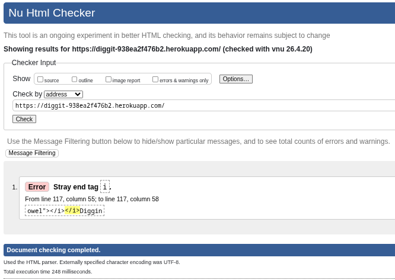
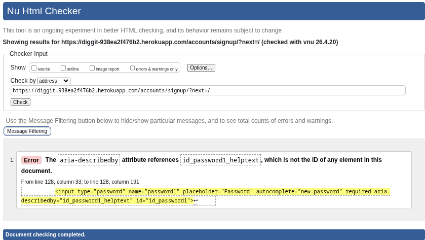
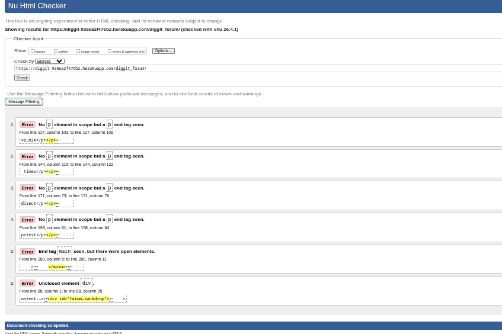
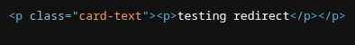
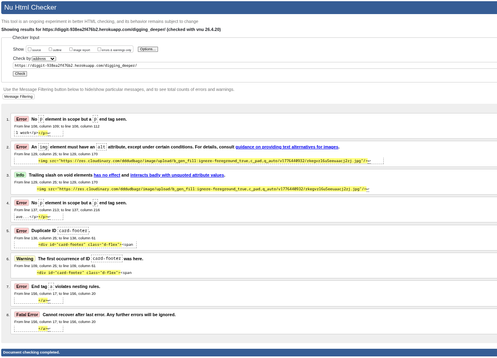
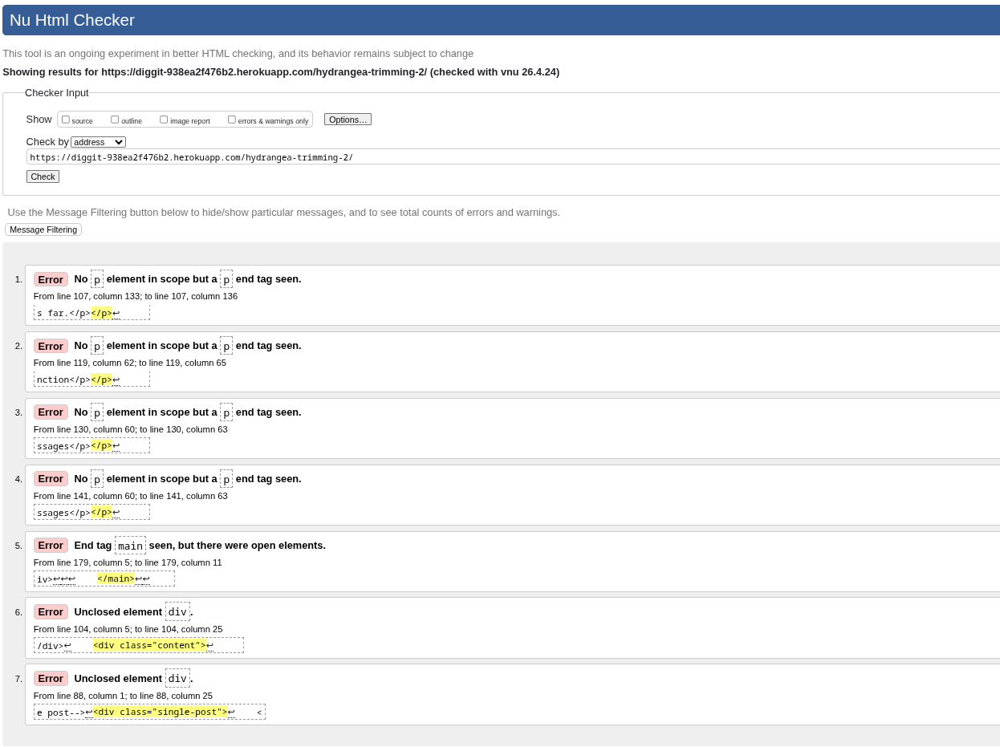

# Testing

> [!NOTE]  
> Return back to the [README.md](README.md) file.

⚠️ INSTRUCTIONS ⚠️

In the following sections, you need to convince the assessors that you have conducted enough manual testing to legitimately believe that the site works well. Essentially, in this part, you should go over all of your project's features, and ensure that they all work as intended, with the project providing an easy and straightforward way for the users to achieve their goals.

⚠️ --- END --- ⚠️

## Code Validation

⚠️ INSTRUCTIONS ⚠️

Use the space below to discuss code validation for all of your own code files (*where applicable*). You are not required to validate external libraries/frameworks.

**MANDATORY**: You must provide a screenshot for each file you validate.

**PRO TIP**: Where possible, always validate the live URL pages/files, not your local code using copy/paste. There could be subtle/hidden differences.

⚠️ --- END --- ⚠️

### HTML

⚠️ INSTRUCTIONS ⚠️

1. [*recommended*] If you are using the live deployed site URLs, validate using this link: https://validator.w3.org/#validate_by_uri
2. Otherwise, if you are copying/pasting your HTML code manually, use this link: https://validator.w3.org/#validate_by_input

It's recommended to validate the live pages (all of them) using the deployed URL. This will give you a custom URL as well, which you can use below on your testing documentation. It makes it easier to return back to a page for validating it again in the future. The URL will look something like this:

- https://validator.w3.org/nu/?doc=https://geraldine-mor.github.io/diggit/index.html

⚠️ --- END --- ⚠️

🛑 IMPORTANT 🛑

RE: Python/Jinja syntax in HTML

Python projects that use Jinja syntax, such as ``, ``, and `{{ variable|filter }}` will not validate properly if you're copying/pasting into the HTML validator.

In order to properly validate these types of files, it's recommended to [validate by uri](https://validator.w3.org/#validate_by_uri) from the deployed Heroku pages.

Unfortunately, pages that require a user to be "logged-in" and authenticated (CRUD functionality) will not work using this method, due to the fact that the HTML Validator (W3C) doesn't have access to login to an account on your project. In order to properly validate HTML pages with Jinja syntax for authenticated pages, follow these steps:

- Navigate to the deployed pages which require authentication.
- Right-click anywhere on the page, and select **View Page Source** (usually `CTRL+U` or `⌘+U` on Mac).
- This will display the entire "compiled" code, without any Jinja syntax.
- Copy everything, and use the [validate by input](https://validator.w3.org/#validate_by_input) method.
- Repeat this process for every page that requires a user to be logged-in/authenticated (e.g.: CRUD functionality).

🛑 ---- END --- 🛑

I have used the recommended [HTML W3C Validator](https://validator.w3.org) to validate all of my HTML files.

| Directory | File | URL | Screenshot | Notes |
| --- | --- | --- | --- | --- |
| blog | [digging_deeper.html](https://github.com/geraldine-mor/diggit/blob/main/blog/templates/blog/digging_deeper.html) | ⚠️ Link (if applicable) |  | Trailing slash on void elements info is caused by the cloudinary field, I have no way to remove. |
| blog | [diggit_forum.html](https://github.com/geraldine-mor/diggit/blob/main/blog/templates/blog/diggit_forum.html) | ⚠️ Link (if applicable) |  | Trailing slash on void elements info is caused by the cloudinary field, I have no way to remove.  |
| blog | [read_post.html](https://github.com/geraldine-mor/diggit/blob/main/blog/templates/blog/read_post.html) | ⚠️ Link (if applicable) |  | ⚠️ Notes (if applicable) |
| contact | [contact.html](https://github.com/geraldine-mor/diggit/blob/main/contact/templates/contact/contact.html) | ⚠️ Link (if applicable) |  | ⚠️ Notes (if applicable) |
| templates | [home.html](https://github.com/geraldine-mor/diggit/blob/main/templates/home.html) | ⚠️ Link (if applicable) |  | ⚠️ Notes (if applicable) |
| templates | [login.html](https://github.com/geraldine-mor/diggit/blob/main/templates/account/login.html) | ⚠️ Link (if applicable) |  | ⚠️ Notes (if applicable) |
| templates | [logout.html](https://github.com/geraldine-mor/diggit/blob/main/templates/account/logout.html) | ⚠️ Link (if applicable) |  | ⚠️ Notes (if applicable) |
| templates | [signup.html](https://github.com/geraldine-mor/diggit/blob/main/templates/account/signup.html) | ⚠️ Link (if applicable) |  | ⚠️ Notes (if applicable) |


**Initial Errors**
| Page | Errors | Actions Taken |
| --- | --- | --- |
| [home.html](https://github.com/geraldine-mor/diggit/blob/main/templates/home.html) |  | Removed trailing `</i>` |
| [signup.html](https://github.com/geraldine-mor/diggit/blob/main/templates/account/signup.html) |  | Assigned the id "id_password_helptext"to the password instructions `<div>` |
| [diggit_forum.html](https://github.com/geraldine-mor/diggit/blob/main/blog/templates/blog/diggit_forum.html) |  | Most of the errors were caused by `{{ post.excerpt \| linebreaks}}` being in a `<p>` element and creating another nested `<p>` element  I changed this to a `<div>`. <br>Closed the `<div class="forum-backdrop">` to resolve the remaining errors |
| [digging_deeper.html](https://github.com/geraldine-mor/diggit/blob/main/blog/templates/blog/digging_deeper.html) |  | A repeat of the issue from diggit_forum.html regarding the double `<p>` elements dealt with the same way.<br> The duplicate id of card-footer was changed to a class.<br> Links were rearranged to remove nesting rule violation |
| [read_post.html](https://github.com/geraldine-mor/diggit/blob/main/blog/templates/blog/read_post.html) |  | Several `<p>` tags were changed to `<div>`<br>`<span>` containing a `<form>` was changed to `<div>`<br>Extra `</form>` elements removed<br>`` relocated to outside the `</div>` because it was causing erroneous unclosed `<div>` errors.


### CSS

⚠️ INSTRUCTIONS ⚠️

1. [*recommended*] If you are using the live deployed site, use this link: https://jigsaw.w3.org/css-validator/#validate_by_uri
2. If you are copying/pasting your CSS code, use this link: https://jigsaw.w3.org/css-validator/#validate_by_input

It's recommended to validate the live site for your primary CSS file on the deployed URL. This will give you a custom URL as well, which you can use below on your testing documentation. It makes it easier to return back to a page for validating it again in the future. The URL will look something like this:

- https://jigsaw.w3.org/css-validator/validator?uri=https://diggit-938ea2f476b2.herokuapp.com

If you have additional/multiple CSS files, then individual "[validation by input](https://jigsaw.w3.org/css-validator/#validate_by_input)" is recommended for the extra CSS files.

**IMPORTANT**: Third-Party tools

If you're using external libraries/frameworks (e.g: Bootstrap, Materialize, Font Awesome, etc.), then sometimes the tool will attempt to also validate these, even though it's not part of your own actual code that you wrote. You are not required to validate the external libraries or frameworks!

⚠️ --- END --- ⚠️

I have used the recommended [CSS Jigsaw Validator](https://jigsaw.w3.org/css-validator) to validate all of my CSS files.

| Directory | File | URL | Screenshot | Notes |
| --- | --- | --- | --- | --- |
| static | [styles.css](https://github.com/geraldine-mor/diggit/blob/main/static/css/styles.css) | ⚠️ Link (if applicable) |  | ⚠️ Notes (if applicable) |


### JavaScript

⚠️ INSTRUCTIONS ⚠️

If using modern JavaScript (ES6) methods, then make sure to include the following line at the very top of every single JavaScript file in your project (this should remain in your files for submission as well):

`/* jshint esversion: 11 */`

If you are also including jQuery (`$`), then the updated format will be:

`/* jshint esversion: 11, jquery: true */`

This allows the JShint validator to recognize modern ES6 methods, such as: `let`, `const`, `template literals`, `arrow functions (=>)`, etc.

**IMPORTANT**: External resources

Sometimes we'll write JavaScript that imports variables from other files, such as "an array of questions" from `questions.js`, which are used within the main `script.js` file elsewhere. If that's the case, the JShint validation tool doesn't know how to recognize "unused variables" that would normally be imported locally when running your own project. These warnings are acceptable, so showcase on your screenshot(s).

The same thing applies when using external libraries such as Stripe, Leaflet, Bootstrap, Materialize, etc. To instantiate these components, we need to use their respective declarator. Again, the JShint validation tool would flag these as "undefined/unused variables". These warnings are acceptable, so showcase on your screenshot(s).

⚠️ --- END --- ⚠️

I have used the recommended [JShint Validator](https://jshint.com) to validate all of my JS files.

| Directory | File | URL | Screenshot | Notes |
| --- | --- | --- | --- | --- |
| static | [script.js](https://github.com/geraldine-mor/diggit/blob/main/static/js/script.js) |  |  | ⚠️ Notes (if applicable) |


### Python

⚠️ INSTRUCTIONS ⚠️

The [CI Python Linter](https://pep8ci.herokuapp.com) can be used two different ways.

- Copy/Paste your Python code directly into the linter.
- As an API, using the "raw" URL appended to the linter URL.
    - To find the "raw" URL, navigate to your file directly on the GitHub repo.
    - On that page, GitHub provides a button on the right called "Raw" that you can click.
    - From that new page, copy the full URL, and paste it after the CI Python Linter URL (with a `/` separator).

It's recommended to validate each file using the API URL. This will give you a custom URL which you can use on your testing documentation. It makes it easier to return back to a file for validating it again in the future. Use the steps above to generate your own custom URLs for each Python file.

**IMPORTANT**: `E501 line too long` errors

You must strive to fix all Python lines that are too long (>80 characters). In rare cases where you cannot break the lines [*without breaking the functionality*], adding "`  # noqa`" (*NO Quality Assurance*) to the end of those lines will ignore linting validation. Do not use "`  # noqa`" all over your project just to clear down validation errors! This can still cause a project to fail, for failing to fix actual PEP8 validation errors.

Sometimes variables can get too long, or excessive `if/else` conditional statements. These are acceptable instances to use the "`  # noqa`" comment.

When trying to fix "line too long" errors, try to avoid using `/` to split lines. A better approach would be to use any type of opening bracket, and hit `<Enter>` just after that. Any opening bracket type will work: `(`, `[`, `{`. By using an opening bracket, Python knows where to appropriately indent the next line of code, without having to *guess* for yourself and attempt to "tab" to the correct indentation level.

⚠️ --- END --- ⚠️

🛑 IMPORTANT 🛑

**IMPORTANT**: Django settings

The Django `settings.py` file comes with 4 lines that are quite long, and will throw the `E501 line too long` error. This is default behavior, but can be fixed by adding the "`  # noqa`" comment at the end of those lines.

```python
AUTH_PASSWORD_VALIDATORS = [
    {
        "NAME": "django.contrib.auth.password_validation.UserAttributeSimilarityValidator",  # noqa
    },
    {
        "NAME": "django.contrib.auth.password_validation.MinimumLengthValidator",  # noqa
    },
    {
        "NAME": "django.contrib.auth.password_validation.CommonPasswordValidator",  # noqa
    },
    {
        "NAME": "django.contrib.auth.password_validation.NumericPasswordValidator",  # noqa
    },
]
```

**IMPORTANT**: *migration* and *pycache* files

You do not have to validate files from the `migrations/` or `pycache/` folders! Ignore these `.py` files, and validate just the files that you've created or modified.

🛑 --- END --- 🛑

I have used the recommended [PEP8 CI Python Linter](https://pep8ci.herokuapp.com) to validate all of my Python files.

| Directory | File | URL | Screenshot | Notes |
| --- | --- | --- | --- | --- |
| blog | [admin.py](https://github.com/geraldine-mor/diggit/blob/main/blog/admin.py) | [PEP8 CI Link](https://pep8ci.herokuapp.com/https://raw.githubusercontent.com/geraldine-mor/diggit/main/blog/admin.py) |  | ⚠️ Notes (if applicable) |
| blog | [choices.py](https://github.com/geraldine-mor/diggit/blob/main/blog/choices.py) | [PEP8 CI Link](https://pep8ci.herokuapp.com/https://raw.githubusercontent.com/geraldine-mor/diggit/main/blog/choices.py) |  | ⚠️ Notes (if applicable) |
| blog | [forms.py](https://github.com/geraldine-mor/diggit/blob/main/blog/forms.py) | [PEP8 CI Link](https://pep8ci.herokuapp.com/https://raw.githubusercontent.com/geraldine-mor/diggit/main/blog/forms.py) |  | ⚠️ Notes (if applicable) |
| blog | [models.py](https://github.com/geraldine-mor/diggit/blob/main/blog/models.py) | [PEP8 CI Link](https://pep8ci.herokuapp.com/https://raw.githubusercontent.com/geraldine-mor/diggit/main/blog/models.py) |  | ⚠️ Notes (if applicable) |
| blog | [tests.py](https://github.com/geraldine-mor/diggit/blob/main/blog/tests.py) | [PEP8 CI Link](https://pep8ci.herokuapp.com/https://raw.githubusercontent.com/geraldine-mor/diggit/main/blog/tests.py) |  | ⚠️ Notes (if applicable) |
| blog | [urls.py](https://github.com/geraldine-mor/diggit/blob/main/blog/urls.py) | [PEP8 CI Link](https://pep8ci.herokuapp.com/https://raw.githubusercontent.com/geraldine-mor/diggit/main/blog/urls.py) |  | ⚠️ Notes (if applicable) |
| blog | [utils.py](https://github.com/geraldine-mor/diggit/blob/main/blog/utils.py) | [PEP8 CI Link](https://pep8ci.herokuapp.com/https://raw.githubusercontent.com/geraldine-mor/diggit/main/blog/utils.py) |  | ⚠️ Notes (if applicable) |
| blog | [views.py](https://github.com/geraldine-mor/diggit/blob/main/blog/views.py) | [PEP8 CI Link](https://pep8ci.herokuapp.com/https://raw.githubusercontent.com/geraldine-mor/diggit/main/blog/views.py) |  | ⚠️ Notes (if applicable) |
| contact | [admin.py](https://github.com/geraldine-mor/diggit/blob/main/contact/admin.py) | [PEP8 CI Link](https://pep8ci.herokuapp.com/https://raw.githubusercontent.com/geraldine-mor/diggit/main/contact/admin.py) |  | ⚠️ Notes (if applicable) |
| contact | [forms.py](https://github.com/geraldine-mor/diggit/blob/main/contact/forms.py) | [PEP8 CI Link](https://pep8ci.herokuapp.com/https://raw.githubusercontent.com/geraldine-mor/diggit/main/contact/forms.py) |  | ⚠️ Notes (if applicable) |
| contact | [models.py](https://github.com/geraldine-mor/diggit/blob/main/contact/models.py) | [PEP8 CI Link](https://pep8ci.herokuapp.com/https://raw.githubusercontent.com/geraldine-mor/diggit/main/contact/models.py) |  | ⚠️ Notes (if applicable) |
| contact | [tests.py](https://github.com/geraldine-mor/diggit/blob/main/contact/tests.py) | [PEP8 CI Link](https://pep8ci.herokuapp.com/https://raw.githubusercontent.com/geraldine-mor/diggit/main/contact/tests.py) |  | ⚠️ Notes (if applicable) |
| contact | [urls.py](https://github.com/geraldine-mor/diggit/blob/main/contact/urls.py) | [PEP8 CI Link](https://pep8ci.herokuapp.com/https://raw.githubusercontent.com/geraldine-mor/diggit/main/contact/urls.py) |  | ⚠️ Notes (if applicable) |
| contact | [views.py](https://github.com/geraldine-mor/diggit/blob/main/contact/views.py) | [PEP8 CI Link](https://pep8ci.herokuapp.com/https://raw.githubusercontent.com/geraldine-mor/diggit/main/contact/views.py) |  | ⚠️ Notes (if applicable) |
| diggit | [settings.py](https://github.com/geraldine-mor/diggit/blob/main/diggit/settings.py) | [PEP8 CI Link](https://pep8ci.herokuapp.com/https://raw.githubusercontent.com/geraldine-mor/diggit/main/diggit/settings.py) |  | ⚠️ Notes (if applicable) |
| diggit | [urls.py](https://github.com/geraldine-mor/diggit/blob/main/diggit/urls.py) | [PEP8 CI Link](https://pep8ci.herokuapp.com/https://raw.githubusercontent.com/geraldine-mor/diggit/main/diggit/urls.py) |  | ⚠️ Notes (if applicable) |
|  | [manage.py](https://github.com/geraldine-mor/diggit/blob/main/manage.py) | [PEP8 CI Link](https://pep8ci.herokuapp.com/https://raw.githubusercontent.com/geraldine-mor/diggit/main/manage.py) |  | ⚠️ Notes (if applicable) |


## Responsiveness

⚠️ INSTRUCTIONS ⚠️

Use this space to discuss testing the live/deployed site on various device sizes.

The minimum requirement is to test the following 3 sizes:

- Mobile
- Tablet
- Desktop

**IMPORTANT**: You must provide screenshots of your results, to "prove" that you've actually tested them.

Using the [amiresponsive](http://ami.responsivedesign.is) mockup images (*or similar*) does not meet the requirements. Consider using some of the built-in device sizes from the Developer Tools.

If you have tested the project on your actual mobile phone or tablet, consider also including screenshots of these as well. It showcases a higher level of manual tests, and can be seen as a positive inclusion!

⚠️ --- END --- ⚠️

I've tested my deployed project to check for responsiveness issues.

| Page | Mobile | Tablet | Desktop | Notes |
| --- | --- | --- | --- | --- |
| Register |  |  |  | Works as expected |
| Login |  |  |  | Works as expected |
| Home |  |  |  | Works as expected |
| Add Blog |  |  |  | Works as expected |
| Edit Blog |  |  |  | Works as expected |
| Blog Post |  |  |  | Works as expected |
| 404 |  |  |  | Works as expected |

## Browser Compatibility

⚠️ INSTRUCTIONS ⚠️

Use this space to discuss testing the live/deployed site on various browsers. Consider testing at least 3 different browsers, if available on your system. You DO NOT need to use all of the browsers below, just pick any 3 (minimum).

Recommended browsers to consider:
- [Chrome](https://www.google.com/chrome)
- [Firefox (Developer Edition)](https://www.mozilla.org/firefox/developer)
- [Edge](https://www.microsoft.com/edge)
- [Safari](https://support.apple.com/downloads/safari)
- [Brave](https://brave.com/download)
- [Opera](https://www.opera.com/download)

**IMPORTANT**: You must provide screenshots of the browsers you've tested, to "prove" that you've actually tested them.

Please note, there are services out there that can test multiple browser compatibilities at the same time. Some of these are paid services, but some are free. If you use these, you must provide a link to the source used for attribution, and multiple screenshots of the results.

⚠️ --- END --- ⚠️

I've tested my deployed project on multiple browsers to check for compatibility issues.

| Page | Chrome | Firefox | Safari | Notes |
| --- | --- | --- | --- | --- |
| Register |  |  |  | Works as expected |
| Login |  |  |  | Works as expected |
| Home |  |  |  | Works as expected |
| Add Blog |  |  |  | Works as expected |
| Edit Blog |  |  |  | Works as expected |
| Blog Post |  |  |  | Works as expected |
| 404 |  |  |  | Works as expected |

## Lighthouse Audit

⚠️ INSTRUCTIONS ⚠️

Use this space to discuss testing the live/deployed site's Lighthouse Audit reports. Avoid testing the local version (Gitpod/VSCode/etc.), as this can have knock-on effects for performance. If you don't have "Lighthouse" in your Developer Tools, it can be added as an [extension](https://chrome.google.com/webstore/detail/lighthouse/blipmdconlkpinefehnmjammfjpmpbjk).

Unless your project is a single-page application (SPA), you should test Lighthouse Audit results for all of your pages, for both *mobile* and *desktop*.

**IMPORTANT**: You must provide screenshots of the results, to "prove" that you've actually tested them.

⚠️ --- END --- ⚠️

I've tested my deployed project using the Lighthouse Audit tool to check for any major issues. Some warnings are outside of my control, and mobile results tend to be lower than desktop.

| Page | Mobile | Desktop |
| --- | --- | --- |
| Register |  |  |
| Login |  |  |
| Home |  |  |
| Add Blog |  |  |
| Edit Blog |  |  |
| Blog Post |  |  |
| 404 |  |  |

## Defensive Programming

⚠️ INSTRUCTIONS ⚠️

Defensive programming (defensive design) is extremely important! When building projects that accept user inputs or forms, you should always test the level of security for each form field. Examples of this could include (but not limited to):

All Projects:

- Users cannot submit an empty form (add the `required` attribute)
- Users must enter valid field types (ensure the correct input `type=""` is used)
- Users cannot brute-force a URL to navigate to a restricted pages

Python Projects:

- Users cannot perform CRUD functionality if not authenticated (if login functionality exists)
- User-A should not be able to manipulate data belonging to User-B, or vice versa
- Non-Authenticated users should not be able to access pages that require authentication
- Standard users should not be able to access pages intended for superusers/admins

You'll want to test all functionality on your application, whether it's a standard form, or CRUD functionality, for data manipulation on a database. Try to access various pages on your site as different user types (User-A, User-B, guest user, admin, superuser). You should include any manual tests performed, and the expected results/outcome.

Testing should be replicable (can someone else replicate the same outcome?). Ideally, tests cases should focus on each individual section of every page on the website. Each test case should be specific, objective, and step-wise replicable.

Instead of adding a general overview saying that everything works fine, consider documenting tests on each element of the page (eg. button clicks, input box validation, navigation links, etc.) by testing them in their "happy flow", their "bad/exception flow", mentioning the expected and observed results, and drawing a parallel between them where applicable.

Consider using the following format for manual test cases:

- Expected Outcome / Test Performed / Result Received / Fixes Implemented

- **Expected**: "Feature is expected to do X when the user does Y."
- **Testing**: "Tested the feature by doing Y."
- (either) **Result**: "The feature behaved as expected, and it did Y."
- (or) **Result**: "The feature did not respond to A, B, or C."
- **Fix**: "I did Z to the code because something was missing."

Use the table below as a basic start, and expand on it using the logic above.

⚠️ --- END --- ⚠️

Defensive programming was manually tested with the below user acceptance testing:

| Page | Expectation | Test | Result | Screenshot |
| --- | --- | --- | --- | --- |
| Blog Management | Feature is expected to allow the blog owner to create new posts with a title, featured image, and content. | Created a new post with valid title, image, and content data. | Post was created successfully and displayed correctly in the blog. |  |
| | Feature is expected to allow the blog owner to update existing posts. | Edited the content of an existing blog post. | Post was updated successfully with the new content. |  |
| | Feature is expected to allow the blog owner to delete blog posts. | Attempted to delete a blog post, confirming the action before proceeding. | Blog post was deleted successfully. |  |
| | Feature is expected to retrieve a list of all published posts. | Accessed the blog owner dashboard to view all published posts. | All published posts were displayed in a list view. |  |
| | Feature is expected to preview posts as drafts before publishing. | Created a draft post and previewed it. | Draft was displayed correctly in preview mode. |  |
| Comments Management | Feature is expected to allow the blog owner to approve or reject comments. | Approved and rejected comments from the dashboard. | Approved comments were published; rejected comments were removed. |  |
| | Feature is expected to allow the blog owner to edit or delete comments. | Edited and deleted existing comments. | Comments were updated or removed successfully. |  |
| User Authentication | Feature is expected to allow registered users to log in to the site. | Attempted to log in with valid and invalid credentials. | Login was successful with valid credentials; invalid credentials were rejected. |  |
| | Feature is expected to allow users to register for an account. | Registered a new user with unique credentials. | User account was created successfully. |  |
| | Feature is expected to allow users to log out securely. | Logged out and tried accessing a restricted page. | Access was denied after logout, as expected. |  |
| User Comments | Feature is expected to allow registered users to leave comments on blog posts. | Logged in and added comments to a blog post. | Comments were successfully added and marked as pending approval. |  |
| | Feature is expected to display a notification that comments are pending approval. | Added a comment and checked the notification message. | Notification was displayed as expected. |  |
| | Feature is expected to allow users to edit their own comments. | Edited personal comments. | Comments were updated as expected. |  |
| | Feature is expected to allow users to delete their own comments. | Deleted personal comments. | Comments were removed as expected. |  |
| Guest Features | Feature is expected to allow guest users to read blog posts without registering. | Opened blog posts as a guest user. | Blog posts were fully accessible without logging in. |  |
| | Feature is expected to display the names of other commenters on posts. | Checked the names of commenters on posts as a guest user. | Commenter names were displayed as expected. |  |
| | Feature is expected to block standard users from brute-forcing admin pages. | Attempted to navigate to admin-only pages by manipulating the URL (e.g., `/admin`). | Access was blocked, and a message was displayed showing denied access. |  |
| 404 Error Page | Feature is expected to display a 404 error page for non-existent pages. | Navigated to an invalid URL (e.g., `/test`). | A custom 404 error page was displayed as expected. |  |

## User Story Testing

⚠️ INSTRUCTIONS ⚠️

Testing User Stories is actually quite simple, once you've already got the stories defined on your README.

Most of your project's **Features** should already align with the **User Stories**, so this should be as simple as creating a table with the User Story, matching with the re-used screenshot from the respective Feature.

⚠️ --- END --- ⚠️

| Target | Expectation | Outcome | Screenshot |
| --- | --- | --- | --- |
| As a blog owner | I would like to create new blog posts with a title, featured image, and content | so that I can share my experiences with my audience. |  |
| As a blog owner | I would like to update existing blog posts | so that I can correct or add new information to my previous stories. |  |
| As a blog owner | I would like to delete blog posts | so that I can remove outdated or irrelevant content from my blog. |  |
| As a blog owner | I would like to retrieve a list of all my published blog posts | so that I can manage them from a central dashboard. |  |
| As a blog owner | I would like to preview a post as draft before publishing it | so that I can ensure formatting and content appear correctly. |  |
| As a blog owner | I would like to review comments before they are published | so that I can filter out spam or inappropriate content. |  |
| As a blog owner | I would like to approve or reject comments from users | so that I can maintain control over the discussion on my posts. |  |
| As a blog owner | I would like to view a list of all comments (both approved and pending) | so that I can manage user engagement effectively. |  |
| As a blog owner | I would like to edit or delete user comments | so that I can clean up or remove inappropriate responses after they've been posted. |  |
| As a registered user | I would like to log in to the site | so that I can leave comments on blog posts. |  |
| As a registered user | I would like to register for an account | so that I can become part of the community and engage with the blog. |  |
| As a registered user | I would like to leave a comment on a blog post | so that I can share my thoughts or ask questions about the owner's experiences. |  |
| As a registered user | I would like my comment to show my name and the timestamp | so that others can see who I am and when I left the comment. |  |
| As a registered user | I would like to receive a notification or message saying my comment is pending approval | so that I understand it hasn't been posted immediately. |  |
| As a registered user | I would like to edit or delete my own comments | so that I can fix mistakes or retract my statement. |  |
| As a guest user | I would like to read blog posts without registering | so that I can enjoy the content without needing to log in. |  |
| As a guest user | I would like to browse past posts | so that I can explore the blog's full content history. |  |
| As a guest user | I would like to register for an account | so that I can participate in the community by leaving comments on posts. |  |
| As a guest user | I would like to see the names of other commenters on posts | so that I can get a sense of community interaction before registering. |  |
| As a user | I would like to see a 404 error page if I get lost | so that it's obvious that I've stumbled upon a page that doesn't exist. |  |

## Automated Testing

I have conducted a series of automated tests on my application.

> [!NOTE]  
> I fully acknowledge and understand that, in a real-world scenario, an extensive set of additional tests would be more comprehensive.

### JavaScript (Jest Testing)

⚠️ INSTRUCTIONS ⚠️

Adjust the code below (file names, function names, etc.) to match your own project files/folders. Use these notes loosely when documenting your own Jest procedures, and remove/adjust where applicable.

- Installing Node.js (**Windows**)
  - https://codeinstitute.s3.eu-west-1.amazonaws.com/nodejs-installation-guides/Installing+and+maintaining+NodeJS+(Windows).pdf
- Installing Node.js (**MacOS**)
  - https://codeinstitute.s3.eu-west-1.amazonaws.com/nodejs-installation-guides/Installing+and+maintaining+NodeJS+(MacOS).pdf

⚠️ SAMPLE ⚠️

I have used the [Jest](https://jestjs.io) JavaScript testing framework to test the application functionality. In order to work with Jest, I first had to initialize NPM.

- `npm init`
- Hit `<enter>` for all options, except for **test command:**, just type `jest`.

Add Jest to a list called **Dev Dependencies** in a dev environment:

- `npm install --save-dev jest`

**IMPORTANT**: Initial configurations

When creating test files, the name of the file needs to be `file-name.test.js` in order for Jest to properly work. Without the following, Jest won't properly run the tests:

- `npm install -D jest-environment-jsdom`

Due to a change in Jest's default configuration, you'll need to add the following code to the top of the `.test.js` file:

```js
/**
 * @jest-environment jsdom
 */

/* jshint esversion: 11, jquery: true */
/* global jest, require, describe, beforeEach, afterEach, test, expect, global */

const { test, expect } = require("@jest/globals");
const { function1, function2, function3, etc. } = require("../script-name");

beforeAll(() => {
    let fs = require("fs");
    let fileContents = fs.readFileSync("index.html", "utf-8");
    document.open();
    document.write(fileContents);
    document.close();
});
```

Remember to adjust the `fs.readFileSync()` to the specific file you'd like you test. The example above is testing the `index.html` file.

Finally, at the bottom of the script file where your primary scripts are written, include the following at the very bottom of the file. Make sure to include the name of all of your functions that are being tested in the `.test.js` file.

```js
/* jshint esversion: 11, jquery: true */
/* global module */
if (typeof module !== "undefined") module.exports = {
    function1, function2, function3, etc
};
```

Now that these steps have been undertaken, further tests can be written, and be expected to fail initially. Write JS code that can get the tests to pass as part of the Red-Green refactor process. Once ready, to run the tests, use this command:

- `npm test`

**NOTE**: To obtain a coverage report, use the following command:

- `npm test --coverage`

Below are the results from the tests that I've written for this application:

| Test Suites | Tests | Screenshot |
| --- | --- | --- |
| 1 passed | 16 passed |  |

#### Jest Test Issues

⚠️ INSTRUCTIONS ⚠️

Use this section to list any known issues you ran into while writing your Jest tests. Remember to include screenshots (where possible), and a solution to the issue (if known). This can be used for both "fixed" and "unresolved" issues. Remove this sub-section entirely if you somehow didn't run into any issues while working with Jest.

⚠️ --- END --- ⚠️

### Python (Unit Testing)

⚠️ INSTRUCTIONS ⚠️

Adjust the code below (file names, function names, etc.) to match your own project files/folders. Use these notes loosely when documenting your own Python Unit tests, and remove/adjust where applicable.

⚠️ SAMPLE ⚠️

I have used Django's built-in unit testing framework to test the application functionality. In order to run the tests, I ran the following command in the terminal each time:

- `python3 manage.py test name-of-app`

To create the coverage report, I would then run the following commands:

- `pip3 install coverage`
- `pip3 freeze --local > requirements.txt`
- `coverage run --omit="*/site-packages/*,*/migrations/*,*/__init__.py,env.py,.env" manage.py test`
- `coverage report`

To see the HTML version of the reports, and find out whether some pieces of code were missing, I ran the following commands:

- `coverage html`
- `python3 -m http.server`

Below are the results from the full coverage report on my application that I've tested:


#### Unit Test Issues

⚠️ INSTRUCTIONS ⚠️

Use this section to list any known issues you ran into while writing your Python unit tests. Remember to include screenshots (where possible), and a solution to the issue (if known). This can be used for both "fixed" and "unresolved" issues. Remove this sub-section entirely if you somehow didn't run into any issues while working with your tests.

⚠️ --- END --- ⚠️

## Bugs

⚠️ INSTRUCTIONS ⚠️

Nobody likes bugs,... except the assessors! Projects seem more suspicious if a student doesn't properly track their bugs. If you're about to submit your project without any bugs listed below, you should ask yourself why you're doing this course in the first place, if you're able to build this entire application without running into any bugs. The best thing you can do for any project is to document your bugs! Not only does it show the true stages of development, but think of it as breadcrumbs for yourself in the future, should you encounter the same/similar bug again, it acts as a gentle reminder on what you did to fix the bug.

If/when you encounter bugs during the development stages of your project, you should document them here, ideally with a screenshot explaining what the issue was, and what you did to fix the bug.

Alternatively, an improved way to manage bugs is to use the built-in **[Issues](https://www.github.com/geraldine-mor/diggit/issues)** tracker on your GitHub repository. This can be found at the top of your repository, the tab called "Issues".

If using the Issues tracker for bug management, you can simplify the documentation process for testing. Issues allow you to directly paste screenshots into the issue page without having to first save the screenshot locally. You can add labels to your issues (e.g. `bug`), assign yourself as the owner, and add comments/updates as you progress with fixing the issue(s). Once you've solved the issue/bug, you should then "Close" it.

When showcasing your bug tracking for assessment, you can use the following examples below.

⚠️ --- END --- ⚠️

### Fixed Bugs

[](https://www.github.com/geraldine-mor/diggit/issues?q=is%3Aissue+is%3Aclosed+label%3Abug)

I've used [GitHub Issues](https://www.github.com/geraldine-mor/diggit/issues) to track and manage bugs and issues during the development stages of my project.

All previously closed/fixed bugs can be tracked [here](https://www.github.com/geraldine-mor/diggit/issues?q=is%3Aissue+is%3Aclosed+label%3Abug).


### Unfixed Bugs

⚠️ INSTRUCTIONS ⚠️

You will need to mention any unfixed bugs and why they are not fixed upon submission of your project. This section should include shortcomings of the frameworks or technologies used. Although time can be a big variable to consider, paucity of time and difficulty understanding implementation is not a valid reason to leave bugs unfixed. Where possible, you must fix all outstanding bugs, unless outside of your control.

If you've identified any unfixed bugs, no matter how small, be sure to list them here! It's better to be honest and list them, because if it's not documented and an assessor finds the issue, they need to know whether or not you're aware of them as well, and why you've not corrected/fixed them.

⚠️ --- END --- ⚠️

[](https://www.github.com/geraldine-mor/diggit/issues?q=is%3Aissue+is%3Aopen+label%3Abug)

Any remaining open issues can be tracked [here](https://www.github.com/geraldine-mor/diggit/issues?q=is%3Aissue+is%3Aopen+label%3Abug).


### Known Issues

| Issue | Screenshot |
| --- | --- |
| The project is designed to be responsive from `375px` and upwards, in line with the material taught on the course LMS. Minor layout inconsistencies may occur on extra-wide (e.g. 4k/8k monitors), or smart-display devices (e.g. Nest Hub, Smart Watches, Gameboy Color, etc.), as these resolutions are outside the project’s scope, as taught by Code Institute. |  |
| When validating HTML with a semantic `<section>` element, the validator warns about lacking a header `h2-h6`. This is acceptable. |  |
| Validation errors on "signup.html" coming from the Django Allauth package. |  |

> [!IMPORTANT]  
> There are no remaining bugs that I am aware of, though, even after thorough testing, I cannot rule out the possibility.

