# Testing

> [!NOTE]  
> Return back to the [README.md](README.md) file.

## Code Validation

### HTML

I used the recommended [HTML W3C Validator](https://validator.w3.org) to validate all of my HTML files. There were errors initially with several of the files, detailed below with their fixes.

| Directory | File | URL | Screenshot | Notes |
| --- | --- | --- | --- | --- |
| blog | [digging_deeper.html](https://github.com/geraldine-mor/diggit/blob/main/blog/templates/blog/digging_deeper.html) | [Link to validator](https://validator.w3.org/nu/?doc=https%3A%2F%2Fdiggit-938ea2f476b2.herokuapp.com%2Fdigging_deeper%2F) | 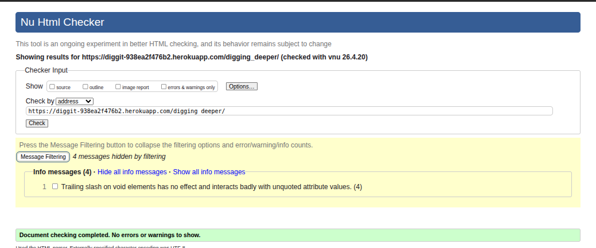 | Trailing slash on void elements info is caused by the cloudinary field, I have no way to remove. |
| blog | [diggit_forum.html](https://github.com/geraldine-mor/diggit/blob/main/blog/templates/blog/diggit_forum.html) | [Link to validator](https://validator.w3.org/nu/?doc=https%3A%2F%2Fdiggit-938ea2f476b2.herokuapp.com%2Fdiggit_forum%2F) | 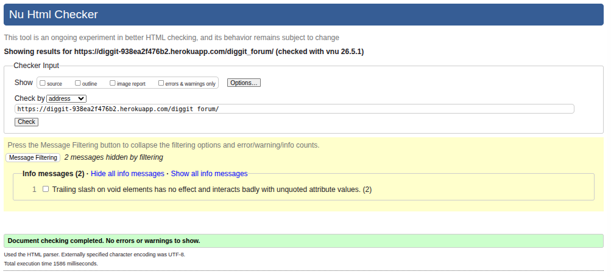 | Trailing slash on void elements info is caused by the cloudinary field, I have no way to remove.  |
| blog | [read_post.html](https://github.com/geraldine-mor/diggit/blob/main/blog/templates/blog/read_post.html) | [Sample validation link](https://validator.w3.org/nu/?doc=https%3A%2F%2Fdiggit-938ea2f476b2.herokuapp.com%2Fapril-showers-and-garden-power-managing-spring-rai%2F) | 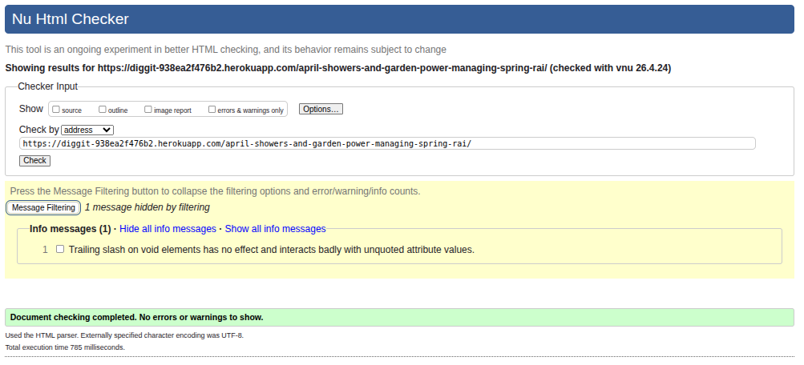 | Trailing slash on void elements info is caused by the cloudinary field, I have no way to remove. |
| contact | [contact.html](https://github.com/geraldine-mor/diggit/blob/main/contact/templates/contact/contact.html) | [Link to validator](https://validator.w3.org/nu/?doc=https%3A%2F%2Fdiggit-938ea2f476b2.herokuapp.com%2Fcontact%2F) | 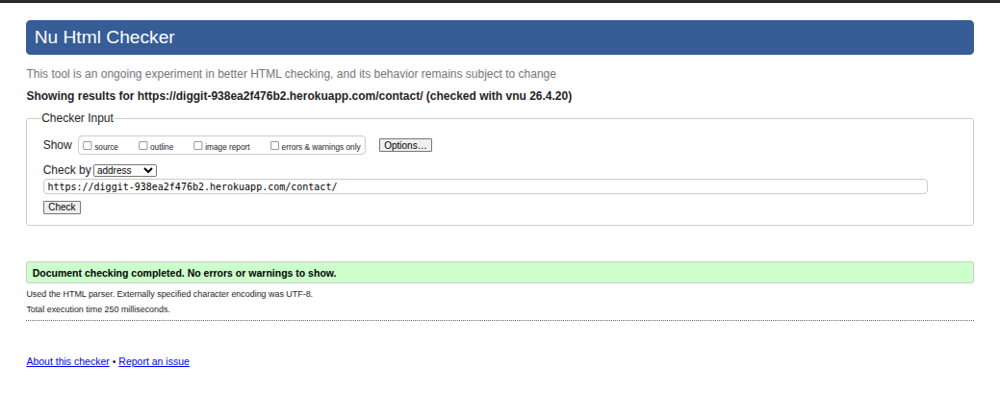 |  |
| templates | [home.html](https://github.com/geraldine-mor/diggit/blob/main/templates/home.html) | [Link to validator](https://validator.w3.org/nu/?doc=https%3A%2F%2Fdiggit-938ea2f476b2.herokuapp.com%2F#textarea) | 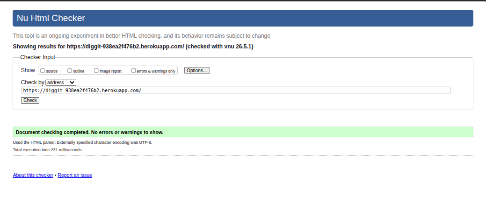 |  |
| templates | [login.html](https://github.com/geraldine-mor/diggit/blob/main/templates/account/login.html) | [Link to validator](https://validator.w3.org/nu/?doc=https%3A%2F%2Fdiggit-938ea2f476b2.herokuapp.com%2Faccounts%2Flogin%2F%3Fnext%3D%2Fdiggit_forum%2F) | 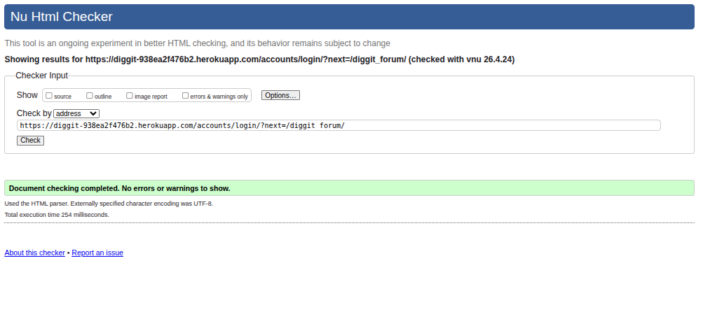 |  |
| templates | [logout.html](https://github.com/geraldine-mor/diggit/blob/main/templates/account/logout.html) | [Link to validator](https://validator.w3.org/nu/?doc=https%3A%2F%2Fdiggit-938ea2f476b2.herokuapp.com%2Faccounts%2Flogout%2F%3Fnext%3D%2F) | 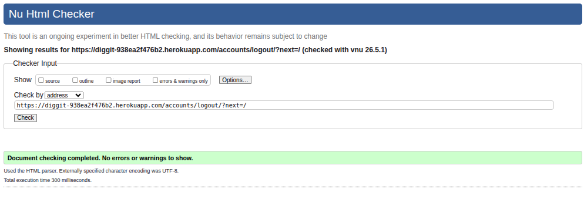 |  |
| templates | [signup.html](https://github.com/geraldine-mor/diggit/blob/main/templates/account/signup.html) | [Link to validator](https://validator.w3.org/nu/?doc=https%3A%2F%2Fdiggit-938ea2f476b2.herokuapp.com%2Faccounts%2Fsignup%2F%3Fnext%3D%2F) | 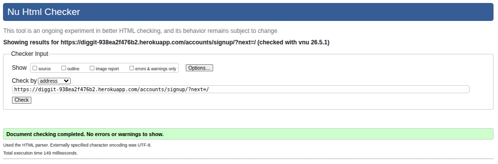 |  |
| 404 | [404.html](https://github.com/geraldine-mor/diggit/blob/main/templates/404.html) | [Link to validator](https://validator.w3.org/nu/?doc=https%3A%2F%2Fdiggit-938ea2f476b2.herokuapp.com%2F404%2F) | 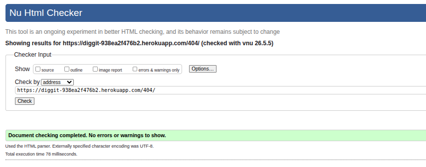 |

**Initial Errors**
| Page | Errors | Actions Taken |
| --- | --- | --- |
| [home.html](https://github.com/geraldine-mor/diggit/blob/main/templates/home.html) | 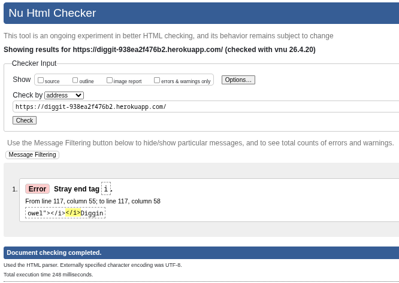 | Removed trailing `</i>` |
| [signup.html](https://github.com/geraldine-mor/diggit/blob/main/templates/account/signup.html) | 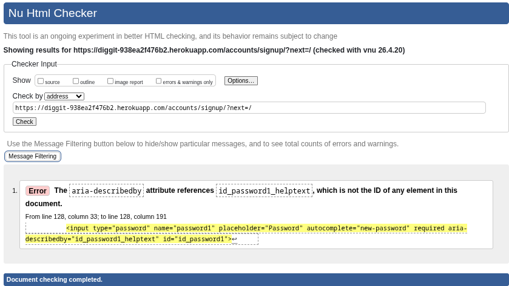 | Assigned the id "id_password1_helptext"to the password instructions `
` |
| [diggit_forum.html](https://github.com/geraldine-mor/diggit/blob/main/blog/templates/blog/diggit_forum.html) | 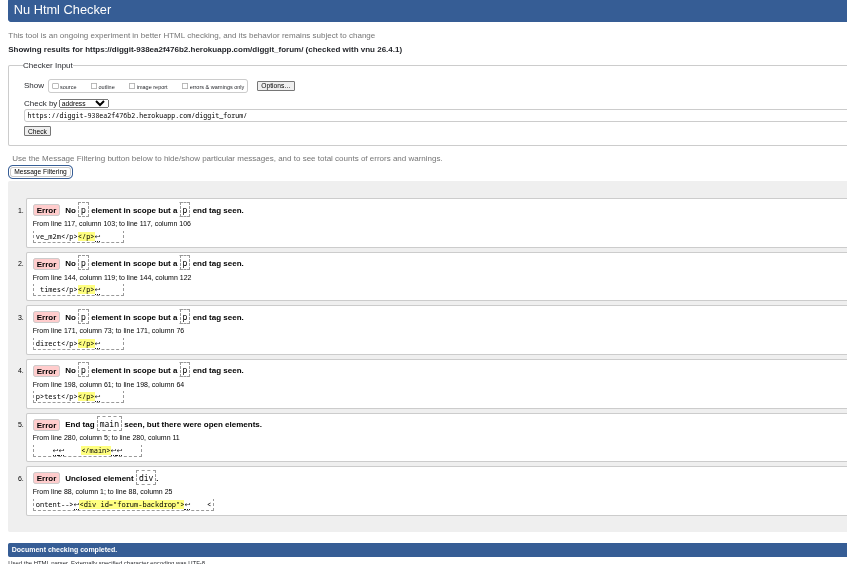 | Most of the errors were caused by `{{ post.excerpt \| linebreaks}}` being in a `
` element and creating another nested `
` element 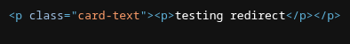 I changed this to a `
`.  Closed the `
` to resolve the remaining errors |
| [digging_deeper.html](https://github.com/geraldine-mor/diggit/blob/main/blog/templates/blog/digging_deeper.html) | 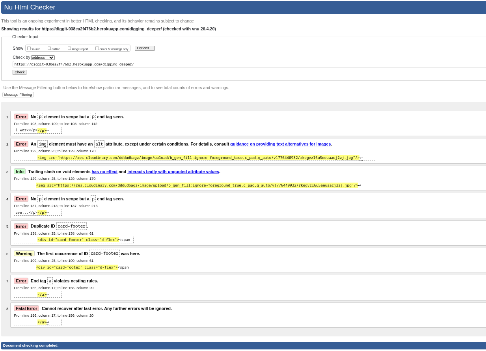 | A repeat of the issue from diggit_forum.html regarding the double `
` elements dealt with the same way.  The duplicate id of card-footer was changed to a class.  Links were rearranged to remove nesting rule violation |
| [read_post.html](https://github.com/geraldine-mor/diggit/blob/main/blog/templates/blog/read_post.html) | 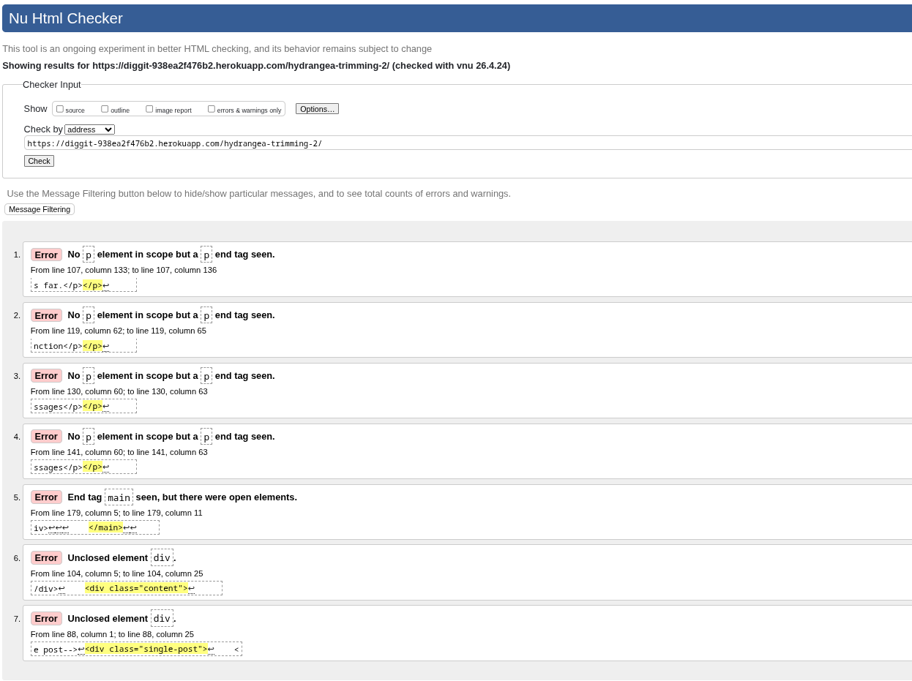 | Several `
` tags were changed to `
` `` containing a `<form>` was changed to `
` Extra `</form>` elements removed `` relocated to outside the `
` because it was causing erroneous unclosed `
` errors. |
| [read_post.html](https://github.com/geraldine-mor/diggit/blob/main/blog/templates/blog/read_post.html) | 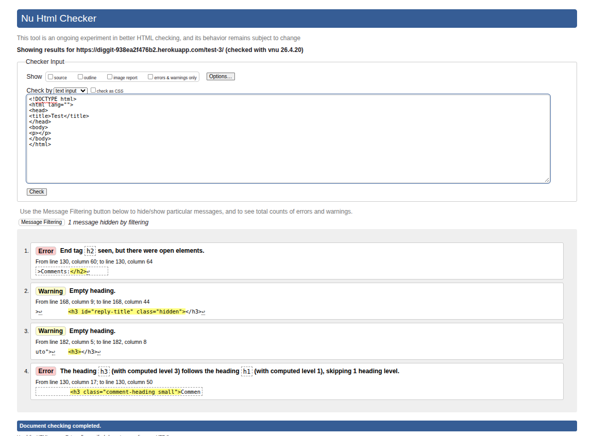 | Default placeholder text added to empty headings, replaced all `<h3>` elements with either `<h2` or `
` to avoid heading discrepancies between blog posts and forum posts |
| [login.html](https://github.com/geraldine-mor/diggit/blob/main/templates/account/login.html) | 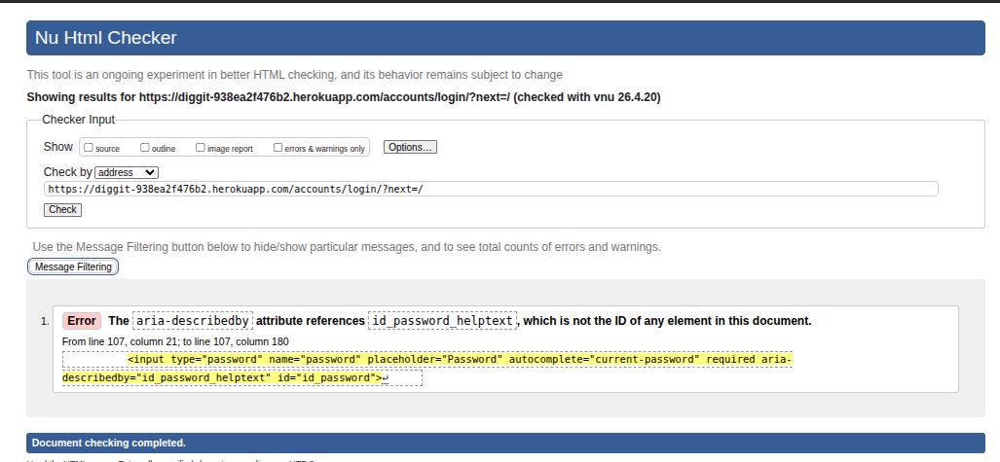 | Created a hidden span to apply the id to since the password helptext is not appropriate in this instance |

### CSS

I used the recommended [CSS Jigsaw Validator](https://jigsaw.w3.org/css-validator/validator?uri=https://diggit-938ea2f476b2.herokuapp.com) to validate all of my CSS files.

When testing via URL, I received 122 errors relating to Bootstrap and 947 warnings so I decided to validate by direct input instead:
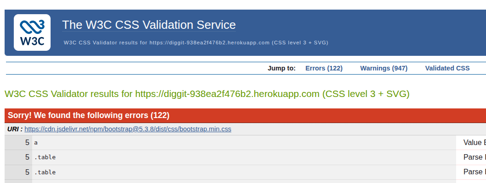

| Directory | File |  Screenshot | Notes |
| --- | --- | --- | --- |
| static | [styles.css](https://github.com/geraldine-mor/diggit/blob/main/static/css/styles.css) |  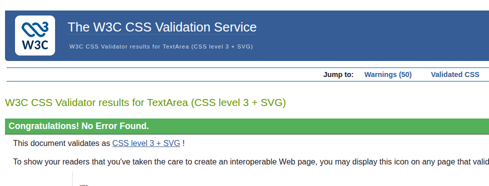 | The warnings relate to the imported fonts and css variables not being checked |
| static | [buttons.css](https://github.com/geraldine-mor/diggit/blob/main/static/css/buttons.css) |  | The warnings all relate to css variables not being checked due to their dynamic nature |

### JavaScript

I have used the recommended [JShint Validator](https://jshint.com) to validate my JS file.

| Directory | File | URL | Screenshot | Notes |
| --- | --- | --- | --- | --- |
| static | [script.js](https://github.com/geraldine-mor/diggit/blob/main/static/js/script.js) |  | 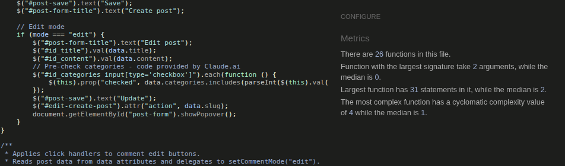 | Initial issues included an unnecessarily named function not being called and several missing or unnecessary semi-colons. All of these were easily rectified 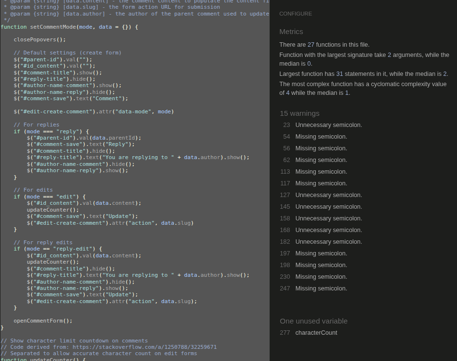 |

### Python

I used the recommended [PEP8 CI Python Linter](https://pep8ci.herokuapp.com) to validate all of my Python files. There were errors initially with several of the files, detailed below with their fixes.

| Directory | File | URL | Screenshot | Notes |
| --- | --- | --- | --- | --- |
| blog | [admin.py](https://github.com/geraldine-mor/diggit/blob/main/blog/admin.py) | [PEP8 CI Link](https://pep8ci.herokuapp.com/https://raw.githubusercontent.com/geraldine-mor/diggit/main/blog/admin.py) | 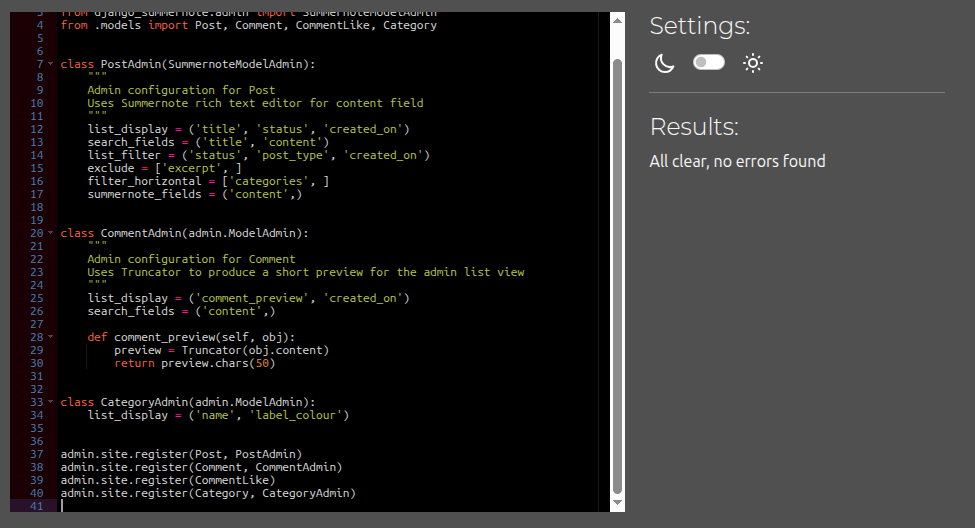 | Code corrections [commit](https://github.com/geraldine-mor/diggit/commit/91a3ea3cf62574bc6c5fba1b1521d9c92c8555f8) |
| blog | [choices.py](https://github.com/geraldine-mor/diggit/blob/main/blog/choices.py) | [PEP8 CI Link](https://pep8ci.herokuapp.com/https://raw.githubusercontent.com/geraldine-mor/diggit/main/blog/choices.py) | 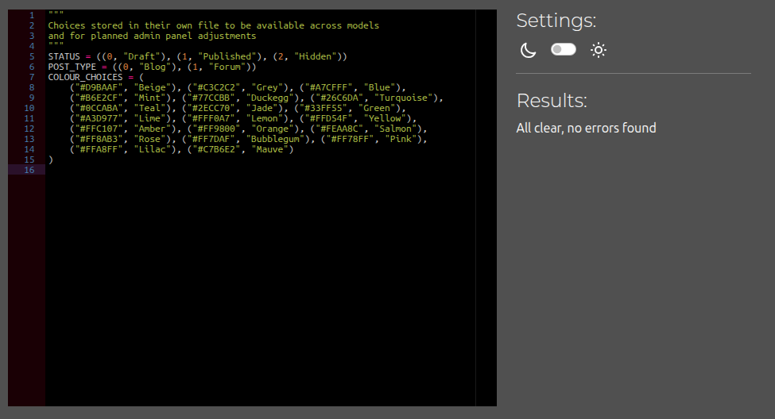 | Code corrections [commit](https://github.com/geraldine-mor/diggit/commit/8001e4f3539d24ed25c8dd26f272e1f781da68d7) |
| blog | [forms.py](https://github.com/geraldine-mor/diggit/blob/main/blog/forms.py) | [PEP8 CI Link](https://pep8ci.herokuapp.com/https://raw.githubusercontent.com/geraldine-mor/diggit/main/blog/forms.py) | 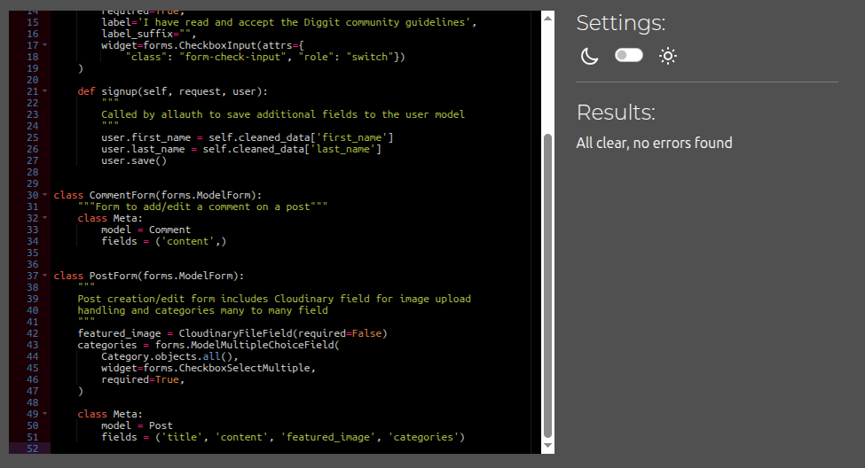 | Code corrections [commit](https://github.com/geraldine-mor/diggit/commit/8001e4f3539d24ed25c8dd26f272e1f781da68d7) |
| blog | [models.py](https://github.com/geraldine-mor/diggit/blob/main/blog/models.py) | [PEP8 CI Link](https://pep8ci.herokuapp.com/https://raw.githubusercontent.com/geraldine-mor/diggit/main/blog/models.py) | 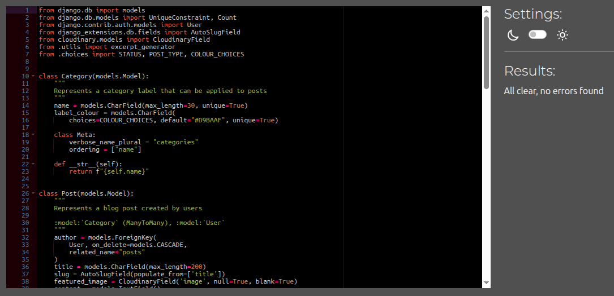 | Code corrections [commit](https://github.com/geraldine-mor/diggit/commit/6db1ccf434734e50f18b317b8fd925b22857de5a) |
| ⚠️ blog | [tests.py](https://github.com/geraldine-mor/diggit/blob/main/blog/tests.py) | [PEP8 CI Link](https://pep8ci.herokuapp.com/https://raw.githubusercontent.com/geraldine-mor/diggit/main/blog/tests.py) |  | ⚠️ Notes (if applicable) |
| blog | [urls.py](https://github.com/geraldine-mor/diggit/blob/main/blog/urls.py) | [PEP8 CI Link](https://pep8ci.herokuapp.com/https://raw.githubusercontent.com/geraldine-mor/diggit/main/blog/urls.py) | 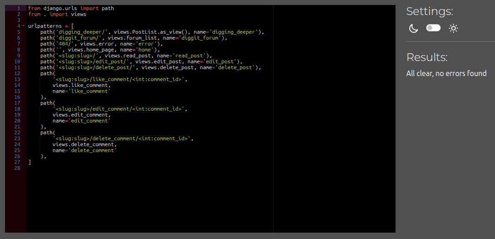 | Code corrections [commit](https://github.com/geraldine-mor/diggit/commit/6db1ccf434734e50f18b317b8fd925b22857de5a) |
| blog | [utils.py](https://github.com/geraldine-mor/diggit/blob/main/blog/utils.py) | [PEP8 CI Link](https://pep8ci.herokuapp.com/https://raw.githubusercontent.com/geraldine-mor/diggit/main/blog/utils.py) | 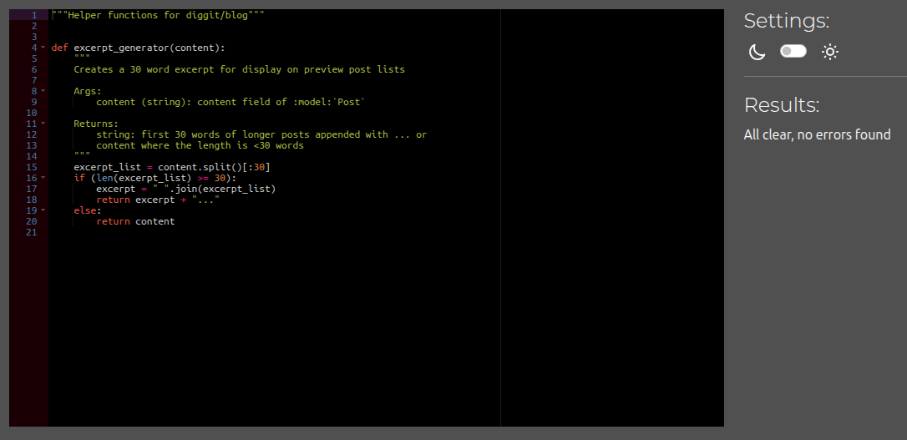 | Code corrections [commit](https://github.com/geraldine-mor/diggit/commit/a6c82cc94753a3c0e6ecf7f92051308993ab1bd0) |
| blog | [views.py](https://github.com/geraldine-mor/diggit/blob/main/blog/views.py) | [PEP8 CI Link](https://pep8ci.herokuapp.com/https://raw.githubusercontent.com/geraldine-mor/diggit/main/blog/views.py) | 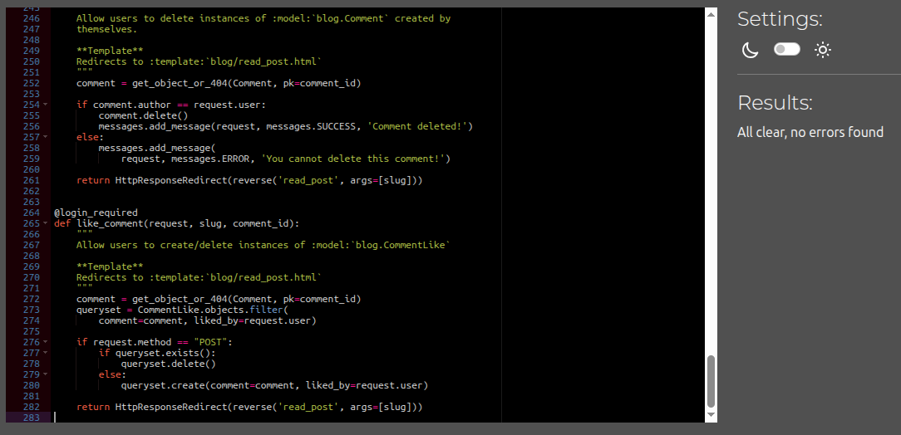 | Code corrections [commit](https://github.com/geraldine-mor/diggit/commit/53964b9c1e8613668d3d21269ba00d8bf28b8fff) |
| contact | [admin.py](https://github.com/geraldine-mor/diggit/blob/main/contact/admin.py) | [PEP8 CI Link](https://pep8ci.herokuapp.com/https://raw.githubusercontent.com/geraldine-mor/diggit/main/contact/admin.py) | 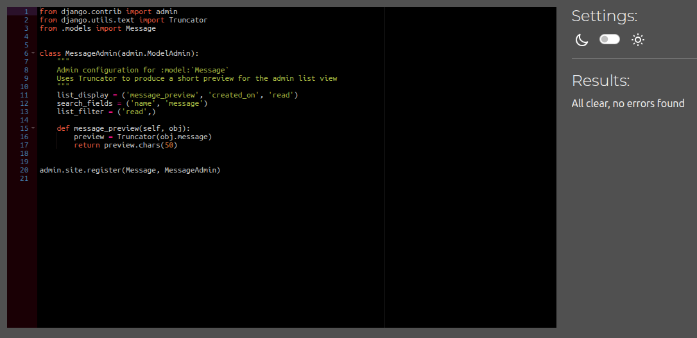 | Code corrections [commit](https://github.com/geraldine-mor/diggit/commit/a6c82cc94753a3c0e6ecf7f92051308993ab1bd0) |
| contact | [forms.py](https://github.com/geraldine-mor/diggit/blob/main/contact/forms.py) | [PEP8 CI Link](https://pep8ci.herokuapp.com/https://raw.githubusercontent.com/geraldine-mor/diggit/main/contact/forms.py) | 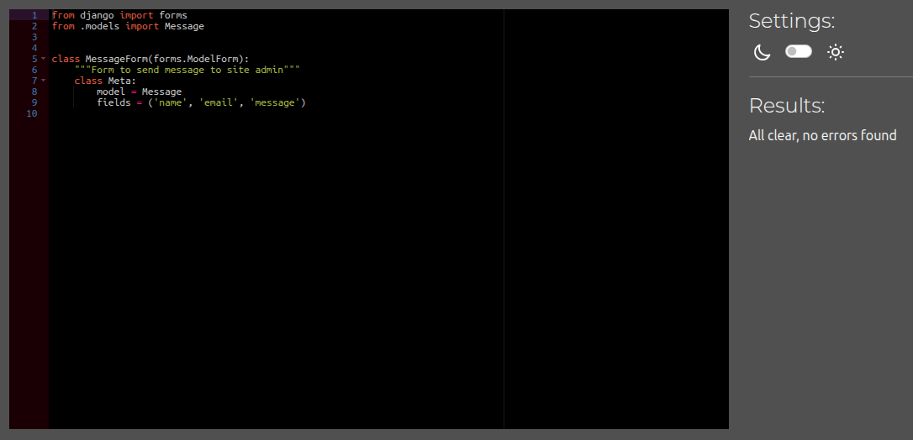 |  |
| contact | [models.py](https://github.com/geraldine-mor/diggit/blob/main/contact/models.py) | [PEP8 CI Link](https://pep8ci.herokuapp.com/https://raw.githubusercontent.com/geraldine-mor/diggit/main/contact/models.py) | 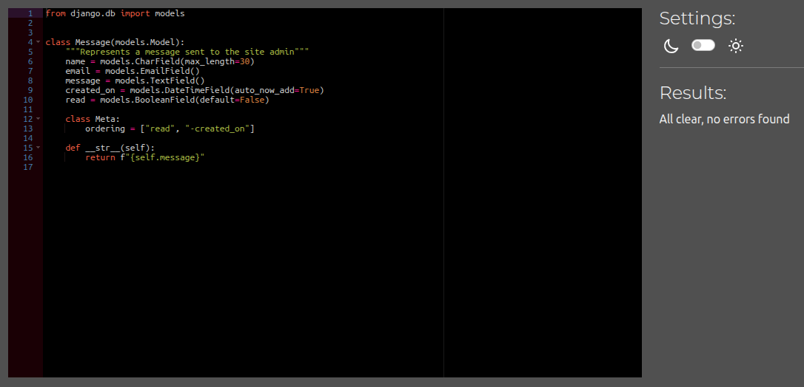 |  |
| ⚠️ contact | [tests.py](https://github.com/geraldine-mor/diggit/blob/main/contact/tests.py) | [PEP8 CI Link](https://pep8ci.herokuapp.com/https://raw.githubusercontent.com/geraldine-mor/diggit/main/contact/tests.py) |  | ⚠️ Notes (if applicable) |
| contact | [urls.py](https://github.com/geraldine-mor/diggit/blob/main/contact/urls.py) | [PEP8 CI Link](https://pep8ci.herokuapp.com/https://raw.githubusercontent.com/geraldine-mor/diggit/main/contact/urls.py) | 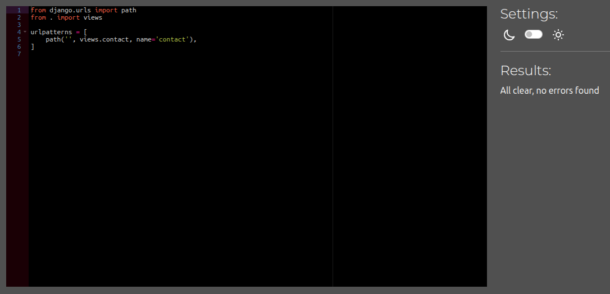 |  |
| contact | [views.py](https://github.com/geraldine-mor/diggit/blob/main/contact/views.py) | [PEP8 CI Link](https://pep8ci.herokuapp.com/https://raw.githubusercontent.com/geraldine-mor/diggit/main/contact/views.py) |  | Code corrections [commit](https://github.com/geraldine-mor/diggit/commit/a6c82cc94753a3c0e6ecf7f92051308993ab1bd0) |
| diggit | [settings.py](https://github.com/geraldine-mor/diggit/blob/main/diggit/settings.py) | [PEP8 CI Link](https://pep8ci.herokuapp.com/https://raw.githubusercontent.com/geraldine-mor/diggit/main/diggit/settings.py) | 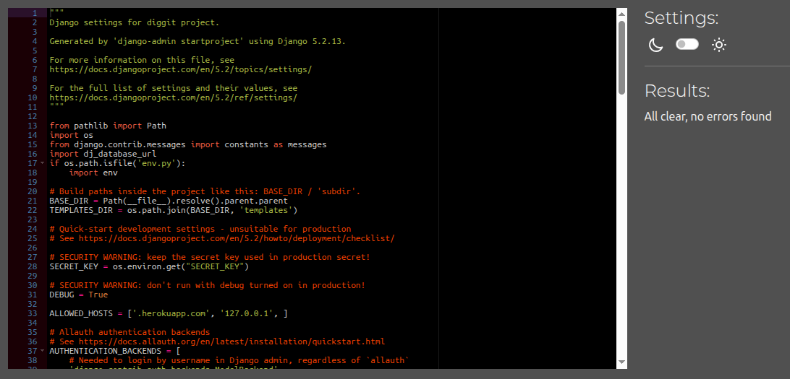 | Code corrections [commit](https://github.com/geraldine-mor/diggit/commit/2fc7d342b57d3bdb771ca52346e86442010edcd3) |
| diggit | [urls.py](https://github.com/geraldine-mor/diggit/blob/main/diggit/urls.py) | [PEP8 CI Link](https://pep8ci.herokuapp.com/https://raw.githubusercontent.com/geraldine-mor/diggit/main/diggit/urls.py) | 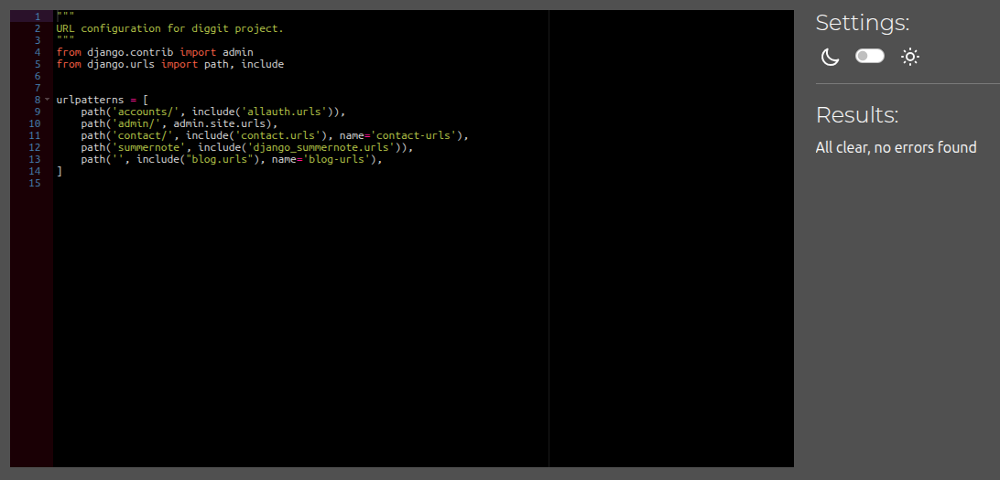 |  |

**Initial Errors**
| File | Errors | Actions Taken |
| --- | --- | --- |
| blog/admin.py | 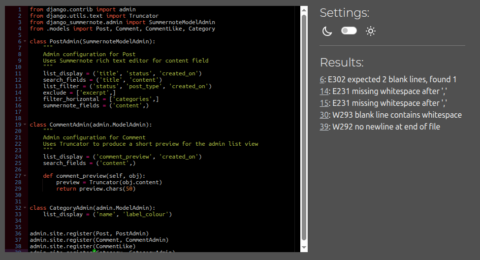 | Simple whitespace and blank line errors, easily corrected |
| blog/choices.py | 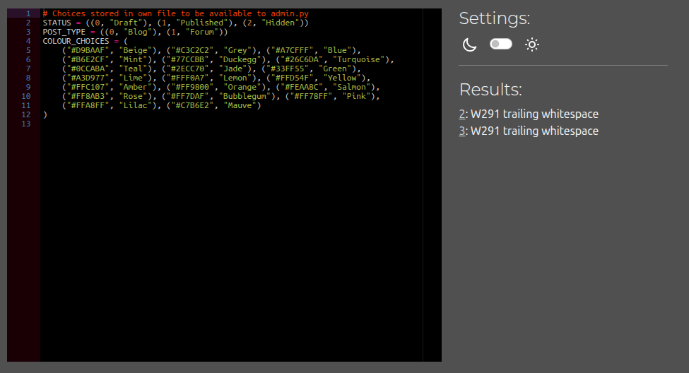 | Simple whitespace and blank line errors, easily corrected |
| blog/forms.py | 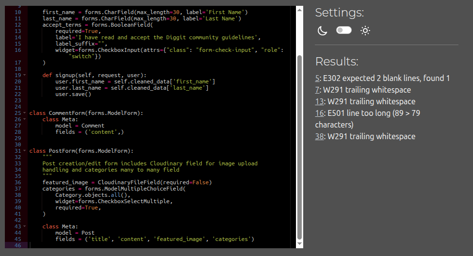 | Simple whitespace and blank line errors were easily corrected, line too long error rectified by breaking the line at an opening curly brace |
| blog/views.py | 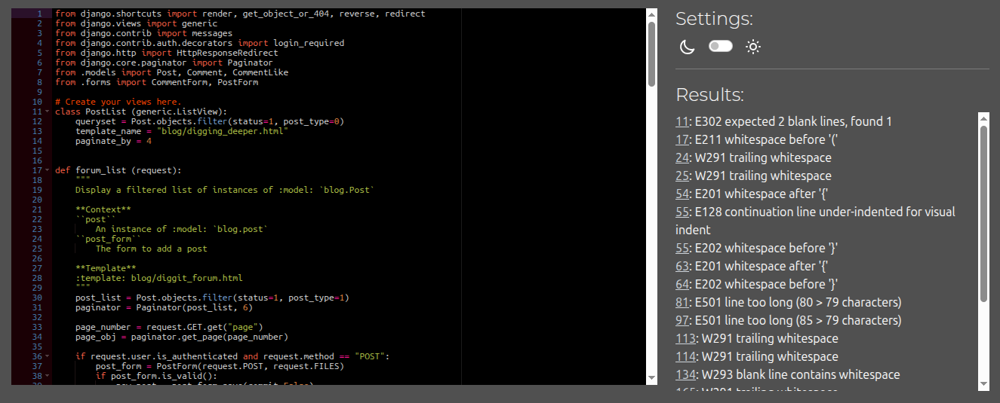 | For all line too long errors, I was able to break the line at a parentheses opening. For the whitespace, blank line and continuation indenting, I simply added or removed the issue as required. |
| blog/views.py | 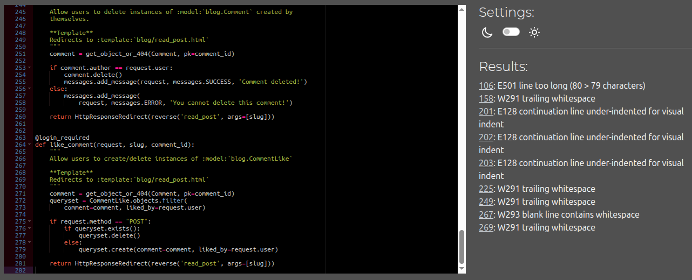 | Folowing code review and commenting, I had these errors and performed the same actions as before to rectify them. | 
| blog/models.py | 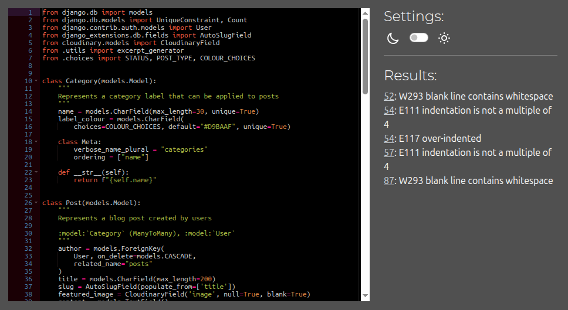 | Blank lines were deleted and indentation errors corrected |
| blog/urls.py | 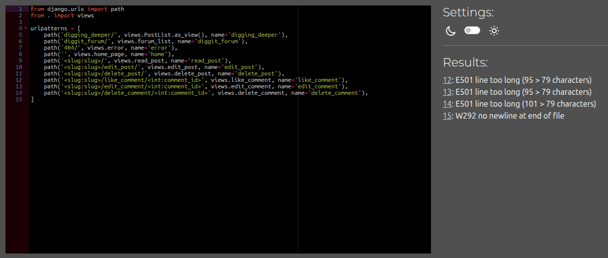 | Line too long errors corrected by breaking the tuple over several lines |
| blog/utils.py | 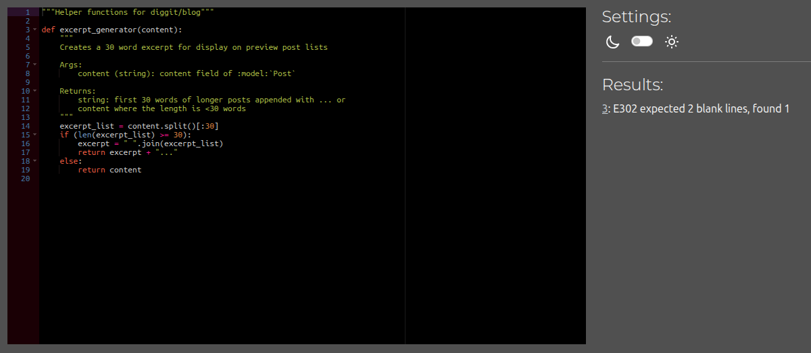 | Added extra line before function |
| contact/admin.py | 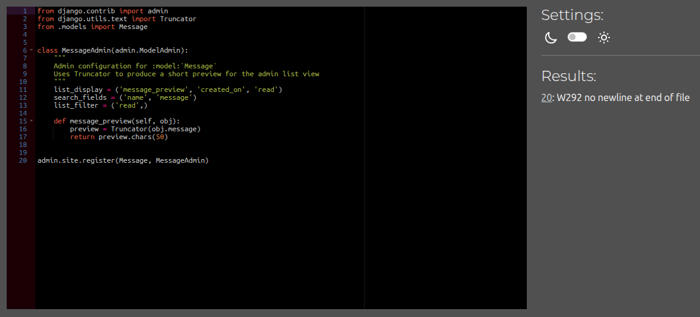 | Added new line at end of file | 
| contact/views.py | 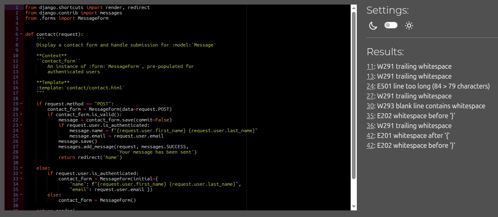 | Deleted whitespaces and broke the f-string over 2 lines | 
| settings.py | 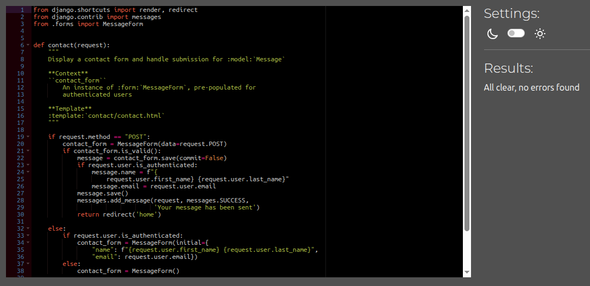 | Added whitespace after ',' in the 2 places indicated. Added `# noqa` at the end of the 4 too lng lines | 

## Responsiveness

I tested my deployed project to check for responsiveness issues.

| Page | Mobile | Tablet | Desktop | Notes |
| --- | --- | --- | --- | --- |
| Home | 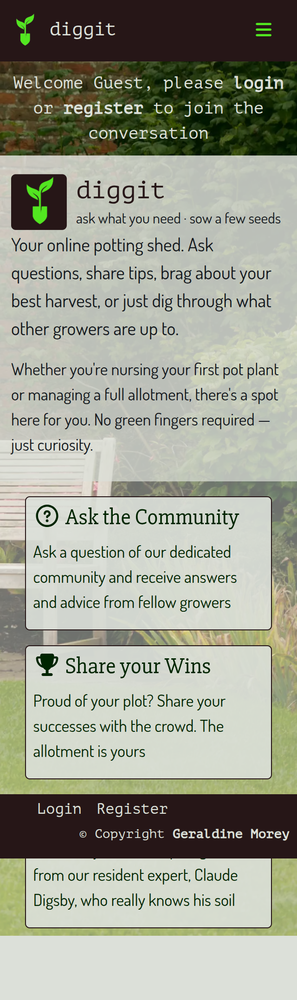 | 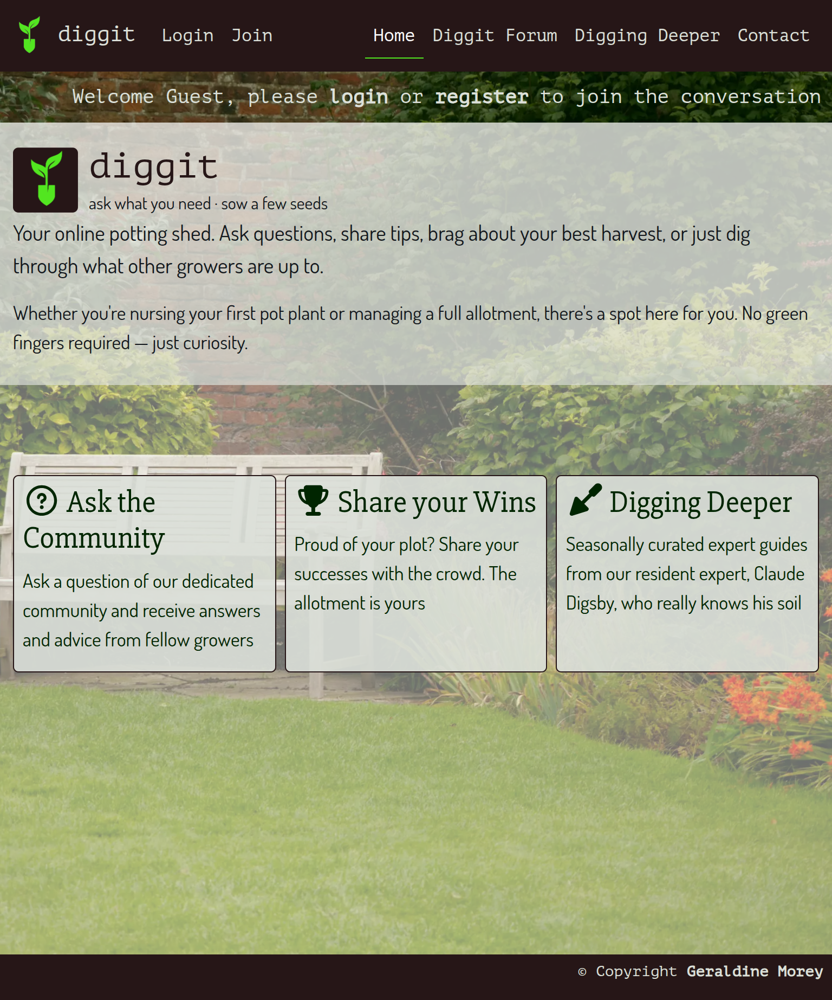 | 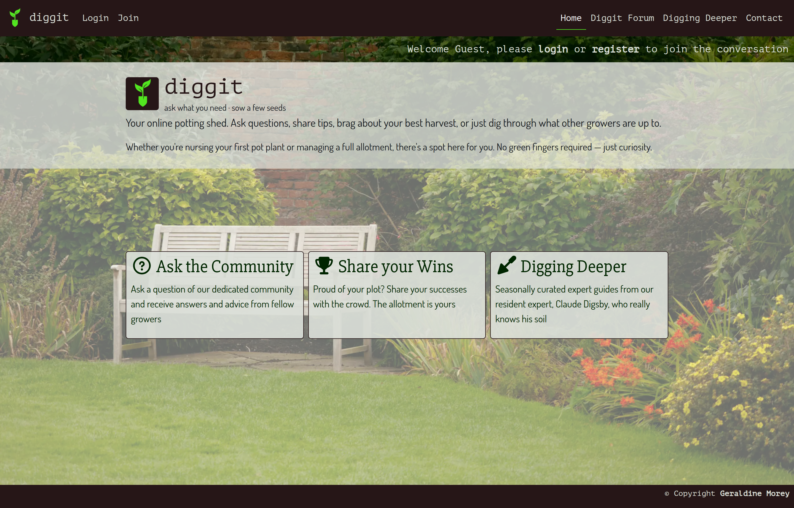 | Works as expected, full size screenshot of mobile looks odd because the footer is fixed |
| Diggit Forum| 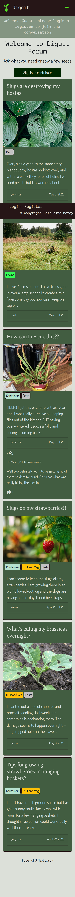 | 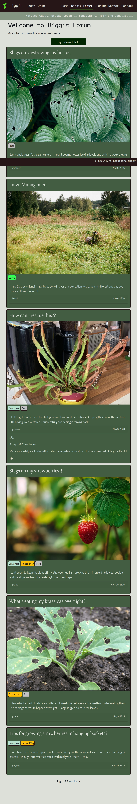 |  | Works as expected |
| Digging Deeper |  |  |  | Works as expected |
| Read Post (blog)|  |  |  | Works as expected |
| Read Post (forum) |  |  |  | Works as expected |
| Contact |  |  |  | Works as expected |
| Signup |  |  |  | Works as expected |
| Login |  |  |  | Works as expected |
| Login |  |  |  | Works as expected |
| Logout |  |  |  | Works as expected |
| 404 |  |  |  | Works as expected |
| Add Post |  |  |  | Works as expected |
| Edit Post |  |  |  | Works as expected |
| Add Comment |  |  |  | Works as expected |
| Edit Comment |  |  |  | Works as expected |

## Device Testing

| Page | Mobile  iPhone SE   375px x 549px| Tablet   5th Gen iPad   768px x 898px| Desktop Ubuntu  22" Dell Monitor   1680px x 963px | Notes |
| --- | --- | --- | --- | --- |
| Home |  |  |  |  |
| Diggit Forum |  |  |  | Forms were visible on the tablet. Issue and fix documented in this [bug](https://github.com/geraldine-mor/diggit/issues/65) |
| Digging Deeper |  |  |  |  |
| Read Post (blog) |  |  |  |  |
| Read Post (forum) |  |  |  |  |
| Contact |  |  |  |  |
| 404 |  |  |  |  |
| Signup |  |  |  |  |
| Login |  |  |  |  |
| Logout |  |  |  |  |
| Add Post |  |  |  | The post form was initially larger than the phone viewport and was not scrolling. Details and fix are documented in this [bug](https://github.com/geraldine-mor/diggit/issues/66) |
| Edit Post |  |  |  |  |
| Add Comment |  |  |  |  |
| Edit Comment |  |  |  |  |

## Browser Compatibility

I've tested my deployed project on multiple browsers to check for compatibility issues. All works as expected. There are differences in how the form fields display when focused - this is browser default behaviour and is acceptable.

| Page | Chrome | Firefox | Safari   (iPhone SE)| Opera | 
| --- | --- | --- | --- | --- | 
| Home |  |  |  |  | 
| Diggit Forum |  |  |  |  | 
| Digging Deeper |  |  |  |  | 
| Read Post (blog) |  |  |  |  | 
| Read Post (forum) |  |  |  |  | 
| Contact |  |  |  |  | 
| 404 |  |  |  |  | 
| Signup |  |  |  |  | 
| Login |  |  |  |  | 
| Logout |  |  |  |  | 
| Add Post |  |  |  |  | 
| Edit Post |  |  |  |  | 
| Add Comment |  |  |  |  | 
| Edit Comment |  |  |  |  | 

## Lighthouse Audit

I tested my deployed project using the Lighthouse Audit tool to check for any major issues. Some warnings are outside of my control, and mobile results tend to be lower than desktop.

Issues that could be rectified are documented [here](https://github.com/geraldine-mor/diggit/issues/68) with their respective fixes.

| Page | Mobile | Desktop | 
| --- | --- | --- | 
| Home |  |  |  
| Diggit Forum |  |  |  
| Digging Deeper |  |  |  
| Read Post (blog) |  |  |  
| Read Post (forum) |  |  |  
| Contact |  |  |  
| 404 |  |  |  
| Signup |  |  |  
| Login |  |  |  
| Logout |  |  |  

## Defensive Programming

⚠️ Work in Progress ⚠️

Defensive programming was manually tested with the below user acceptance testing:

| Page | Expectation | Test | Expected Result | Result | Screenshot |
| --- | --- | --- | --- | --- | --- |
| Authentication |  |  |  |  | 
| Signup | Form should not submit with any empty fields | Tried to submit form with blank fields | Form validation on the form fields prevents submission and displays error messages |  |  |
| | Form should reject malformed email addresses | Tried to submit "thunder" in the email field | Form type validation on the email field prevents submission and displays an error message |  |  |
| | Form should reject any passwords that don't meet the acceptance criteria | Tried to use "NigelBarker", "four", "password" and "12345678" | Form refuses submission and displays error message |  |  |
| | A user cannot register with a username already in use | Tried to create a 2nd account with username "Barker" | Form refuses submission and displays error message |  |  |
| Login | A user cannot login with incorrect credentials | Tried to login with valid username and incorrect password, incorrect username and valid password and both details incorrect | Form refuses submission and displays error message |  |  |
|  | Logged out users visiting restricted URLs are redirected to login | While logged out, navigated directly to /slugs-are-destroying-my-hostas/edit_post/  | Redirects to login page |  |  |
| Logout | After logging out, restricted pages cannot be accessed | Logged out, then used the back button to attempt to access admin dashboard | Access is denied, login requested |  |  |
| Diggit Forum |  |  |  |  |
| Create Post | Logged out users cannot create posts even if hidden popover is manually triggered through DOM manipulation | Using DevTools in mobile view, manually added `popovertarget="post-form"` and `popovertargetaction="show"` attributes to the nav-toggle button to expose the hidden post-form popover while logged out | The form may visually display, but form submission is rejected because the user is unauthenticated |  |  |
|  | A user cannot submit a post with any of the required fields missing (title, content and category) | Tried to submit the form with each of the required fields missing | Form refuses submission and displays error message |  |  |  
| Edit Post | Logged out users cannot edit any post by directly entering the URL | Tried to access a post edit URL while logged out | Access denied, redirects to login page |  |  |
| | A logged in user cannot edit another user's post by directly entering the URL | Logged in as User A and navigated to User B's edit URL | Access denied, error message displayed to user |    Required update to views, see [commit](https://github.com/geraldine-mor/diggit/commit/3516b6848eed78af6eabcea3e0bea0fa03296eac) |  |
| Delete Post | Logged out users cannot delete posts even if hidden popovers and delete URLs are manually injected through DOM manipulation | Using DevTools in mobile view, manually added `popovertarget="post-delete"` and `popovertargetaction="show"` attributes to the nav-toggle button to expose the hidden post-delete popover while logged out, then manually injected the delete-post URL into the confirmation button | The delete confirmation popover may visually display and contain a valid delete URL, but unauthenticated users are prevented from deleting posts |  |  |
| | Logged out users cannot delete posts by directly entering the URL | Tried to access a post delete URL while logged out | Access denied, redirects to login page |  |  |
| | A logged in user cannot delete another user's post by entering the URL | Tried to navigate directly to a delete post URL of User B while logged in as User A | Access denied, error message displays to user |  |  |
| Comments |  |  |  |  |
| Add Comment | Logged out users cannot add comments even if hidden popover is manually triggered through DOM manipulation | Using DevTools in mobile view, manually added `popovertarget="comment-form"` and `popovertargetaction="show"` attributes to the nav-toggle button to expose the hidden comment-form popover while logged out | The form may visually display, but form submission is rejected because the user is unauthenticated  |  |  |
|  | A user cannot submit an empty comment | Tried to submit a comment form with no content | Form validation on the form field prevents submission and displays error message |  |  |
| Edit Comment | A user cannot edit another user's comment by entering an edit comment URL | Tried to navigate directly to an edit comment URL of User B while logged in as User A | Access denied, error message displays to user |  |  |
|  | A logged out user cannot edit a user's comment by entering an edit comment URL | Tried to access an edit comment URL while logged out | Access denied, redirects to login page |  |  |
| Delete Comment | Logged out users cannot delete comments even if hidden popovers and delete URLs are manually injected through DOM manipulation | Using DevTools in mobile view, manually added `popovertarget="comment-delete"` and `popovertargetaction="show"` attributes to the nav-toggle button to expose the hidden comment-delete popover while logged out, then manually injected the delete-comment URL into the confirmation button | The delete confirmation popover may visually display and contain a valid delete URL, but unauthenticated users are prevented from deleting comments |  |  |
| | Logged out users cannot delete comments by directly entering the URL | Tried to access a comment delete URL while logged out | Access denied, redirects to login page |  |  |
| | A logged in user cannot delete another user's post by entering the URL | Tried to navigate directly to a delete comment URL of User B while logged in as User A | Access denied, error message displays to user |  |  | 
| Comment Likes and Replies |  |  |  |  |
| Comment Likes | A logged out user cannot like comments | While logged out, inspected the comment section and attempted to locate or trigger the like control using DevTools | Like controls are not rendered for unauthenticated users and no like action can be triggered |  |  |
|  | A logged out user cannot force a like by entering a like comment URL | Tried to navigate to a like comment URL while logged out | Like not registered, redirects to login page |  |  |
|  | A user cannot like the same comment more than once | Liked a comment, then tried to like it again | Second like toggles the like off, count does not increment |  |  |
| Replies |  Logged out users cannot reply to comments even if hidden popover is manually triggered through DOM manipulation | Using DevTools in mobile view, manually added `popovertarget="comment-form"` and `popovertargetaction="show"` attributes to the nav-toggle button to expose the hidden comment-form popover while logged out | The form may visually display, but without any reply functionality |  |  | 
| Admin Features |  |  |  |  |
| Admin Panel | A logged out user cannot navigate directly to the admin panel via the URL | Tried to access /admin/ while logged out | Access denied, admin panel login displays |  |  |
|  | A standard logged in user cannot navigate directly to the admin panel via the URL | Tried to access /admin/ while logged in as a standard user | Access denied, admin panel login displays with error message |  |  |
| Create Blog Post | A non-admin user cannot navigate directly to the blog post creation URL | Tried to navigate to /admin/blog/post/add/ while logged in as a standard user and while logged out | Access is denied and login requested |  |  |
| Edit Blog Post | A non-admin user cannot edit Digging Deeper posts via URL manipulation | Tried to navigate to an admin blog post edit URL while logged in as a standard user and while logged out | Access is denied and login requested |  |  |
| Delete Blog Post | A non-admin user cannot delete Digging Deeper posts via URL manipulation | Tried to navigate to an admin blog post edit URL while logged in as a standard user and while logged out | Access is denied and login requested |  |  |
| Contact Form |  |  |  |  |
| Contact Form | A user cannot submit the form with any empty fields | Tried to submit the contact form leaving each field blank | Form validation on the form fields prevents submission and displays error messages |  |  |
|  | Form should reject malformed email addresses | Tried to submit "happy" in the email field | Form type validation on the email field prevents submission and displays an error message |  |  |
| Miscellaneous |  |  |  |  |
| 404 Page | Navigating to a non-existent URL displays a custom 404 page rather than a server error | Navigated to a made-up URL (e.g., /frog/) | Custom 404 page displays with navigation back to homepage |  |  |

## User Story Testing

| Target | Expectation | Outcome | Screenshot |
| --- | --- | --- | --- |
| As a guest | I can view Digging Deeper posts | so that I can access professional gardening advice |  |
| As a site admin | I can create Digging Deeper posts | so that I can share professional advice with the community |  |
| As a site admin | I can edit and delete the Digging Deeper posts | so that I can keep the content accurate and up to date |  | 
| As a registered user | I can comment on Digging Deeper posts | so that I can join the conversation |  | 
| As a guest | I can register for an account | so that I can participate in the community |  |
| As a registering user | I can read and acknowledge the community guidelines | so that I understand the rules before posting |  |
| As a registered user | I can log in to my account | so that I can access my personalised content and actions |  |
| As a logged in user | I can log out of my account | so that my account stays secure |  |
| As a user | I can see my current login state | so that I always know whether I am logged in or out |  |
| As a guest | I can browse user's posts | so that I can read community tips and decide whether to join |  |
| As a user | I can view an individual post and its comments | so that I can read the full content and discussion | |
| As a logged in user | I can create a post | so that I can ask questions or share tips with the gardening community |  |
| As a logged in user | I can edit or delete my posts | so that I have full control of the content I created |  |
| As a site admin | I can access an admin panel | so that I can control the content across the site |  |
| As a site admin | I can delete user content | so that I can ensure community guidelines are adhered to |  |
| As a logged in user | I can comment on posts | so that I can contribute to the discussion or answer a question |  | 
| As a site admin | I can upload and change the blog images | so that I can keep the site fresh and attractive |  |
| As a guest | I can read comments | so that I can benefit from user's experience and decide if I want to join |  |
| As a user | I can contact the site admin | so that I can report an issue or ask a question |  |
| As a logged in user | I can edit or delete my comments | so that I can correct or remove comments that no longer represent me |  |
| As a guest | I can read a brief introduction to the site | so that I can decide to browse as a guest or signup |  |
| As a logged in user | I can react to comments | so that I can help the community identify the most helpful answers |  |
| As a post author | I can upload an image | so that I can ask questions or give advice about my own experiences |  |
| As a user | I can see the most popular comments first | so that the most helpful answers are easy to find |  |
| As a user | I want to return to the page I was viewing after signup/login | so that I can continue interacting with the content |  |
| As a logged in user | I can reply to comments | so that I can add more insight to the conversation |  |
| As a user | I can expect that multiple posts will spread over several pages | so that I can maintain a clean easy to use interface |  |
| As a user | I can assign categories to my post | so that it can be discovered by other users |  |

## Automated Testing

I have conducted a series of automated tests on my application.

> [!NOTE]  
> I fully acknowledge and understand that, in a real-world scenario, an extensive set of additional tests would be more comprehensive.

### Python (Unit Testing)

⚠️ INSTRUCTIONS ⚠️

Adjust the code below (file names, function names, etc.) to match your own project files/folders. Use these notes loosely when documenting your own Python Unit tests, and remove/adjust where applicable.

⚠️ SAMPLE ⚠️

I have used Django's built-in unit testing framework to test the application functionality. In order to run the tests, I ran the following command in the terminal each time:

- `python3 manage.py test name-of-app`

To create the coverage report, I would then run the following commands:

- `pip3 install coverage`
- `pip3 freeze --local > requirements.txt`
- `coverage run --omit="*/site-packages/*,*/migrations/*,*/__init__.py,env.py,.env" manage.py test`
- `coverage report`

To see the HTML version of the reports, and find out whether some pieces of code were missing, I ran the following commands:

- `coverage html`
- `python3 -m http.server`

Below are the results from the full coverage report on my application that I've tested:


#### Unit Test Issues

⚠️ INSTRUCTIONS ⚠️

Use this section to list any known issues you ran into while writing your Python unit tests. Remember to include screenshots (where possible), and a solution to the issue (if known). This can be used for both "fixed" and "unresolved" issues. Remove this sub-section entirely if you somehow didn't run into any issues while working with your tests.

⚠️ --- END --- ⚠️

## Bugs

⚠️ INSTRUCTIONS ⚠️

Nobody likes bugs,... except the assessors! Projects seem more suspicious if a student doesn't properly track their bugs. If you're about to submit your project without any bugs listed below, you should ask yourself why you're doing this course in the first place, if you're able to build this entire application without running into any bugs. The best thing you can do for any project is to document your bugs! Not only does it show the true stages of development, but think of it as breadcrumbs for yourself in the future, should you encounter the same/similar bug again, it acts as a gentle reminder on what you did to fix the bug.

If/when you encounter bugs during the development stages of your project, you should document them here, ideally with a screenshot explaining what the issue was, and what you did to fix the bug.

Alternatively, an improved way to manage bugs is to use the built-in **[Issues](https://www.github.com/geraldine-mor/diggit/issues)** tracker on your GitHub repository. This can be found at the top of your repository, the tab called "Issues".

If using the Issues tracker for bug management, you can simplify the documentation process for testing. Issues allow you to directly paste screenshots into the issue page without having to first save the screenshot locally. You can add labels to your issues (e.g. `bug`), assign yourself as the owner, and add comments/updates as you progress with fixing the issue(s). Once you've solved the issue/bug, you should then "Close" it.

When showcasing your bug tracking for assessment, you can use the following examples below.

⚠️ --- END --- ⚠️

### Fixed Bugs

I've used [GitHub Issues](https://www.github.com/geraldine-mor/diggit/issues) to track and manage bugs and issues during the development stages of my project.

All previously closed/fixed bugs can be tracked [here](https://www.github.com/geraldine-mor/diggit/issues?q=is%3Aissue+is%3Aclosed+label%3Abug).


### Unfixed Bugs

⚠️ INSTRUCTIONS ⚠️

You will need to mention any unfixed bugs and why they are not fixed upon submission of your project. This section should include shortcomings of the frameworks or technologies used. Although time can be a big variable to consider, paucity of time and difficulty understanding implementation is not a valid reason to leave bugs unfixed. Where possible, you must fix all outstanding bugs, unless outside of your control.

If you've identified any unfixed bugs, no matter how small, be sure to list them here! It's better to be honest and list them, because if it's not documented and an assessor finds the issue, they need to know whether or not you're aware of them as well, and why you've not corrected/fixed them.

⚠️ --- END --- ⚠️

Any remaining open issues can be tracked [here](https://www.github.com/geraldine-mor/diggit/issues?q=is%3Aissue+is%3Aopen+label%3Abug).


### Known Issues

| Issue | Screenshot |
| --- | --- |
| The project is designed to be responsive from `320px` and upwards, in line with the material taught on the course LMS. Minor layout inconsistencies may occur on extra-wide (e.g. 4k/8k monitors), or smart-display devices (e.g. Nest Hub, Smart Watches, Gameboy Color, etc.), as these resolutions are outside the project’s scope, as taught by Code Institute. |  |
| Validation errors on "signup.html" coming from the Django Allauth package. |  |
| User posts created or edited in the admin panel render with `
` tags visible due to the use of Summernote rich text editor in the admin panel, versus a plain textarea on the user-facing form. This is a low-risk edge case as admin users receive site training at handover. Keeping plain text input on the user form intentionally prevents users from 
injecting HTML directly. Differences in format are handled in the template.|  |

> [!IMPORTANT]  
> There are no remaining bugs that I am aware of, though, even after thorough testing, I cannot rule out the possibility.

